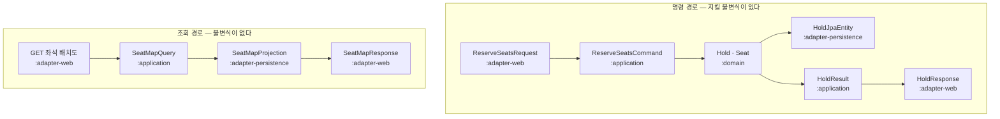

# API 설계

REST + SSE · 4개 트랙 병렬 작업의 계약. 확정일 2026-09-04.

> **작성 범위** — §0~§7. 관측 · 로그는 [operate.md](operate.md)로 분리했다.

## 이 문서가 하는 일

| 대상         | 이 문서에서 얻는 것                  |
| ------------ | ------------------------------------ |
| 백엔드       | 구현할 엔드포인트 · DTO 경계 규칙   |
| 웹 · 모바일 | 호출할 계약 · Mock으로 선행 개발    |

> **URL 목록은 생성 가능하지만 DTO 경계와 에러 체계는 사람이 정해야 한다.** 그래서 §3·§4를 엔드포인트(§5)보다 앞에 뒀다.

---

## §0 계약 원칙

| 항목         | 결정                                                      |
| ------------ | --------------------------------------------------------- |
| 버저닝       | **URL 접두사** `/api/v1`                          |
| 리소스 명명  | 복수 명사 · 케밥 케이스 (`/seat-events`)               |
| JSON 필드    | **camelCase**                                       |
| 본문 형식    | JSON only (`application/json`)                          |
| 페이지네이션 | **offset 방식** — 예약 목록만 필요하고 건수가 적다 |

### 시각 표현 — 두 종류를 구분한다

| 종류                     | 형식                                  | 예                       | 쓰이는 곳                                |
| ------------------------ | ------------------------------------- | ------------------------ | ---------------------------------------- |
| **시각 (instant)** | ISO-8601**UTC** · `Z` 접미사 | `2026-09-10T21:00:00Z` | `expiresAt` `departAt` `createdAt` |
| **영업일 (date)**  | `YYYY-MM-DD` · **KST 기준**  | `2026-09-11`           | `serviceDate` · 조회 파라미터         |

> **의도** — 선점 TTL이 시각 기반이라 **타임존 실수가 곧 초과 판매나 조기 만료로 이어진다.** 서버는 UTC만 내보내고 KST 변환은 클라이언트가 한다.
>
> 다만 **운행일은 타임존이 없는 개념**이다. "9월 11일 첫차"는 KST 영업일이지 순간이 아니다. 이 둘을 같은 타입으로 다루면 자정 근처에서 하루가 밀린다.

### 페이지네이션

```json
{
  "content": [ ... ],
  "page": 0,
  "size": 20,
  "totalElements": 43,
  "totalPages": 3
}
```

> **Spring Data의 `Page`를 그대로 노출하지 않는다.** 자체 `PageResponse<T>`를 `:adapter-web`에 정의한다 — 프레임워크 타입이 계약에 새면 §3 규칙이 처음부터 깨진다.

---

## §1 리소스 모델

| 리소스             | 뜻             | 수명                 |
| ------------------ | -------------- | -------------------- |
| `station`        | 역             | 영구 · 읽기 전용    |
| `trip`           | 운행           | 시드 · 읽기 전용    |
| **`hold`** | **선점** | **10분**       |
| `reservation`    | 예약           | 영구 (취소해도 남음) |
| `payment`        | 결제 시도      | 영구                 |

> **`hold`를 1급 리소스로 둔다.** "좌석을 잡았다"는 상태가 URL로 표현돼야 새로고침·앱 재시작 후에도 이어갈 수 있다. 화면 상태가 아니라 서버 상태다.

### 엔드포인트 목록

**조회**

| 메서드  | 경로                                          | 기능     |
| ------- | --------------------------------------------- | -------- |
| `GET` | `/api/v1/stations`                          | `F-01` |
| `GET` | `/api/v1/trips?from=&to=&date=&passengers=` | `F-02` |
| `GET` | `/api/v1/trips/{tripId}/seats`              | `F-03` |

**선점**

| 메서드     | 경로                       | 기능                   |
| ---------- | -------------------------- | ---------------------- |
| `POST`   | `/api/v1/holds`          | `F-04` 선점 생성     |
| `GET`    | `/api/v1/holds/{holdId}` | `F-05` 남은 TTL 조회 |
| `DELETE` | `/api/v1/holds/{holdId}` | `F-06` 선점 해제     |

**결제 · 확정** — 2단계다

| 메서드   | 경로                                      | 기능                                               |
| -------- | ----------------------------------------- | -------------------------------------------------- |
| `POST` | `/api/v1/holds/{holdId}/payment-intent` | 결제창에 넘길`orderId` · 금액 발급              |
| `POST` | `/api/v1/holds/{holdId}/payment`        | `F-08` `F-09` 승인 요청 → **예약 확정** |
| `GET`  | `/api/v1/holds/{holdId}/payment`        | 타임아웃 시**결과 폴링**                     |

> **왜 2단계인가** — 토스페이먼츠는 클라이언트가 결제창에서 승인하고, 그 결과(`paymentKey`)를 **서버가 다시 승인 API로 확정**하는 구조다. 1단계로 합치면 클라이언트가 금액을 정하게 되어 위변조 여지가 생긴다.
>
> `GET`이 따로 있는 이유는 `E-03` 결제 타임아웃이다. **새 결제 요청이 아니라 기존 요청의 결과 조회**라는 게 메서드로 드러나야 한다.

**예약 관리**

| 메서드   | 경로                                            | 기능              |
| -------- | ----------------------------------------------- | ----------------- |
| `GET`  | `/api/v1/reservations?page=&size=`            | `F-12` 목록     |
| `GET`  | `/api/v1/reservations/{reservationNo}`        | `F-12` 상세     |
| `POST` | `/api/v1/reservations/{reservationNo}/cancel` | `F-14` `F-15` |

> **취소가 `DELETE`가 아니다.** 예약은 지워지지 않고 `CANCELLED`로 전이한다(`F-14`). `DELETE`를 쓰면 계약이 거짓말을 한다.
>
> 경로 키가 `reservationNo`(8자리)다. 내부 `id`를 노출하지 않는다.

**실시간**

| 메서드  | 경로                                   | 기능                         |
| ------- | -------------------------------------- | ---------------------------- |
| `GET` | `/api/v1/trips/{tripId}/seat-events` | `F-16`~`F-19` SSE 스트림 |

**인증 · 회원**

| 메서드               | 경로                                    | 기능     |
| -------------------- | --------------------------------------- | -------- |
| `POST`             | `/api/v1/auth/signup`                 | `F-20` |
| `GET`              | `/api/v1/auth/email-available?email=` | `F-21` |
| `POST`             | `/api/v1/auth/login`                  | `F-24` |
| `POST`             | `/api/v1/auth/logout`                 | `F-25` |
| `POST`             | `/api/v1/auth/refresh`                | `F-26` |
| `GET` · `PATCH` | `/api/v1/me`                          | `F-22` |

---

## §2 공통 규약

### 요청 헤더

| 헤더                | 필수                     | 내용                                            |
| ------------------- | ------------------------ | ----------------------------------------------- |
| `Authorization`   | 인증 필요 시             | `Bearer <accessToken>`                        |
| `Idempotency-Key` | **결제 확정 필수** | UUID. 화면 진입 시 1회 생성                     |
| `X-Request-Id`    | 선택                     | 없으면 서버가 생성.**응답에 그대로 에코** |
| `Last-Event-ID`   | SSE 재연결 시            | 마지막으로 받은 이벤트 ID                       |

### 응답 헤더

| 헤더             | 내용                               |
| ---------------- | ---------------------------------- |
| `X-Request-Id` | 요청의 것을 에코하거나 서버 생성값 |
| `RateLimit-*`  | 잔여 한도 (Cloudflare + 앱 레벨)   |

### 멱등키 — 어디에 요구하나

| 엔드포인트                   | 멱등키         | 이유                                                    |
| ---------------------------- | -------------- | ------------------------------------------------------- |
| `POST /holds/{id}/payment` | **필수** | 돈이 걸린다. 타임아웃 재시도가 이중 결제가 되면 안 된다 |
| `POST /holds`              | 선택           | 재시도해도 좌석 상태가 진실이라 위험이 낮다             |
| 나머지                       | 불필요         | 자연 멱등이거나 조회                                    |

> 멱등키는 **화면 진입 시 1회 생성**하고 재시도에도 같은 값을 쓴다. 버튼을 누를 때마다 새로 만들면 멱등성이 무의미하다. **모바일은 영속 저장**해야 한다 — 앱이 죽으면 메모리 키가 사라진다.

### 상관관계 ID

```
클라이언트 ──X-Request-Id: 7f3a…──▶ 게이트웨이 ──▶ 앱 서버
                                                  │
                                   MDC에 넣고 모든 로그에 자동 부착
                                                  │
클라이언트 ◀──X-Request-Id: 7f3a…── 응답 (에러 본문에도 포함)
```

> **에러 응답 본문에도 넣는다.** 사용자가 "결제가 안 돼요"라고 하면 화면의 그 값 하나로 로그 전체를 추적할 수 있어야 한다. 로그 쪽 상세는 [operate.md](operate.md).

---

## §3 DTO 설계

### 계층별 타입 — 셋은 다른 물건이다

| 계층              | 접미사                              | 사는 모듈                  | 예                      |
| ----------------- | ----------------------------------- | -------------------------- | ----------------------- |
| HTTP 계약         | `*Request` `*Response`          | **`:adapter-web`** | `ReserveSeatsRequest` |
| 유스케이스 입출력 | `*Command` `*Query` `*Result` | **`:application`** | `ReserveSeatsCommand` |
| 도메인            | **접미사 없음**               | **`:domain`**      | `Hold` `Seat`       |

> 리뷰에서 `*Response` 안에 **접미사 없는 타입**이 보이면 그게 새어나간 것이다.

### 경계를 컴파일러로 강제한다

의존 방향은 안쪽이지만, `:adapter-web`이 전이 의존으로 `:domain`을 **볼 수는 있다.** 그래서 컨트롤러가 도메인 객체를 그대로 뱉어도 빌드가 통과한다. 규율에만 맡기면 반드시 샌다.

```kotlin
// :application/build.gradle.kts
dependencies {
    implementation(project(":domain"))   // ← api 가 아니다
}
```

| 선언                                             | 결과                                                                              |
| ------------------------------------------------ | --------------------------------------------------------------------------------- |
| `api(project(":domain"))`                      | `:adapter-web` 컴파일 클래스패스에 `:domain`이 **올라온다** → 새어나감 |
| **`implementation(project(":domain"))`** | **`:adapter-web`이 `Hold`를 아예 못 본다** → 컴파일 에러               |

> **이 한 줄이 나머지를 강제한다.** 유스케이스가 `Hold`를 반환하는 순간 `:adapter-web`이 그 메서드를 **호출조차 못 하고** 빌드가 깨진다. "도메인을 밖으로 내보내지 마라"가 규율이 아니라 **빌드 실패**가 된다.
>
> `:domain`을 `api`로 바꾸면 벽이 무너진다. **그 한 줄이 이 구조의 급소다.**

```java
// ✕ :adapter-web 이 컴파일 안 됨
Hold reserve(ReserveSeatsCommand cmd);

// ○ :application 소유 타입만 넘긴다
HoldResult reserve(ReserveSeatsCommand cmd);
```

### 4겹 방어

| #            | 장치                                                  | 잡히는 시점                             |
| ------------ | ----------------------------------------------------- | --------------------------------------- |
| **①** | **`implementation(project(":domain"))`**      | **컴파일**                        |
| ②           | 유스케이스 반환 타입 =`:application` 소유           | ①이 강제                               |
| ③           | 접미사 규칙                                           | 코드 리뷰                               |
| ④           | ArchUnit —`..adapter.web..` → `..domain..` 금지 | 테스트 (①이`api`로 바뀌는 사고 대비) |

### 명령 경로 vs 조회 경로 — 매핑 횟수가 다르다



| 경로                                         | 매핑          | 이유                                       |
| -------------------------------------------- | ------------- | ------------------------------------------ |
| **명령** (선점 · 결제 · 취소)        | **3번** | 지킬 불변식이 있다. 도메인이 판정해야 한다 |
| **조회** (운행 · 좌석맵 · 예약 목록) | **1번** | 불변식이 없다. Projection → Response 직행 |

> **조회에 공식적인 우회로를 열어주는 게 명령 경로의 규율을 지킨다.** 800석 좌석맵을 도메인 객체로 빚었다가 다시 푸는 건 순수한 낭비고, 모든 경로에 3번 매핑을 강요하면 개발자가 지겨워서 몰래 도메인을 뱉기 시작한다.
>
> 조회 Projection은 `:adapter-persistence`가 만들고 `:application`이 인터페이스만 선언한다 — **의존 방향은 여전히 안쪽이다.**

### 매핑 코드는 어디에 두나

| 매핑                         | 위치                     |
| ---------------------------- | ------------------------ |
| `*Request` ↔ `*Command` | `:adapter-web`         |
| `*Result` ↔ `*Response` | `:adapter-web`         |
| `*Command` ↔ 도메인       | `:application`         |
| 도메인 ↔ JPA 엔티티         | `:adapter-persistence` |

> **바깥쪽이 안쪽 타입을 아는 것은 정상이다.** 반대가 되면 의존이 뒤집힌다. 매퍼는 항상 **바깥 모듈**에 둔다.
>
> MapStruct는 처음부터 붙이지 않는다. **수동 매퍼로 시작**하고 지루해지면 그때 도입한다 — 애노테이션 프로세서 설정이 구조 학습을 가린다.

### 주요 DTO 스케치

```java
// :adapter-web
record ReserveSeatsRequest(
    Long tripId,
    List<SeatAddress> seats     // 최대 6
) {}
record SeatAddress(int carNo, int rowNo, String colLetter) {}

record HoldResponse(
    String holdId,
    Long tripId,
    List<SeatAddress> seats,
    Instant expiresAt,          // UTC
    int totalFare
) {}
```

```java
// :application
record ReserveSeatsCommand(
    Long tripId,
    MemberId memberId,
    List<SeatAddress> seats,
    Channel channel
) {}

record HoldResult(
    HoldId holdId,
    Long tripId,
    List<SeatAddress> seats,
    Instant expiresAt,
    int totalFare
) {}
```

> `HoldResponse`와 `HoldResult`가 거의 같아 보이는 게 정상이다. **지금 같다는 게 앞으로도 같아야 한다는 뜻은 아니다** — HTTP 응답에 표시용 필드가 붙거나 유스케이스가 내부 값을 더 들고 다니게 되면 그때 갈라진다. 미리 합쳐두면 갈라질 수 없다.

---

## §4 에러 설계

### 4.1 포맷 — RFC 9457 + `code` 확장

| 항목        | 값                                            |
| ----------- | --------------------------------------------- |
| 미디어 타입 | `application/problem+json`                  |
| 표준        | **RFC 9457** (2023-07 · RFC 7807 대체) |
| 확장 필드   | `code` · `requestId` · 상황별 추가      |
| Spring      | `org.springframework.http.ProblemDetail`    |

```json
{
  "type": "https://pi-reservation/problems/seat-conflict",
  "title": "좌석을 선점하지 못했습니다",
  "status": 409,
  "detail": "선택한 6석 중 2석을 다른 고객이 먼저 선점했습니다.",
  "instance": "/api/v1/holds",

  "code": "SEAT_ALREADY_HELD",
  "requestId": "7f3a9c21",
  "failedSeats": [
    { "carNo": 4, "rowNo": 7, "colLetter": "B", "reason": "HELD_BY_OTHER" },
    { "carNo": 4, "rowNo": 7, "colLetter": "A", "reason": "ALL_OR_NOTHING" }
  ]
}
```

| 필드          | 성격                                           |
| ------------- | ---------------------------------------------- |
| `type`      | 문제 유형 URI.**유형마다 고정**          |
| `title`     | 그 유형의 이름.**유형마다 고정**         |
| `detail`    | **이번 발생**에 대한 설명. 매번 다름     |
| `code`      | **프론트가 분기하는 열쇠.** 확장 필드    |
| `requestId` | 상관관계 ID (§2).**모든 에러에 넣는다** |

> **왜 `code`를 따로 두나** — 표준상 식별자는 `type` URI지만, 프론트가 긴 URI 문자열을 비교하는 건 장황하다. `code` 하나면 `switch`가 끝난다.
>
> **왜 `requestId`를 본문에 넣나** — 사용자가 "결제가 안 돼요"라고 할 때 **화면에 보이는 값 하나로 로그 전체를 추적**할 수 있어야 한다.

### 4.2 에러 코드 체계

**`리소스_상황`** · `SCREAMING_SNAKE_CASE`

| 규칙                 | 예                                        |
| -------------------- | ----------------------------------------- |
| 리소스가 주어        | `SEAT_ALREADY_HELD` · `HOLD_EXPIRED` |
| 상황은 결과 상태     | `_NOT_FOUND` `_EXPIRED` `_EXCEEDED` |
| HTTP 상태와 1:1 아님 | 같은`409`에 여러 `code`가 있다        |

### 4.3 HTTP 상태 매핑

**예매 · 좌석**

| 상황                  | status  | `code`                        |
| --------------------- | ------- | ------------------------------- |
| 좌석을 남이 이미 가짐 | `409` | `SEAT_ALREADY_HELD`           |
| **락 타임아웃** | `409` | **`SEAT_LOCK_TIMEOUT`** |
| 6석 초과 선택         | `400` | `SEAT_COUNT_EXCEEDED`         |
| 선점 TTL 만료         | `410` | `HOLD_EXPIRED`                |
| 남의 선점 접근        | `403` | `HOLD_NOT_OWNED`              |
| 운행 없음             | `404` | `TRIP_NOT_FOUND`              |

> **`SEAT_ALREADY_HELD`와 `SEAT_LOCK_TIMEOUT`을 반드시 구분한다.** 둘 다 `409`지만 사용자에게 할 말이 정반대다.
>
> | code                  | 뜻                               | 화면                                    |
> | --------------------- | -------------------------------- | --------------------------------------- |
> | `SEAT_ALREADY_HELD` | **확정적으로 남이 가졌다** | "다른 좌석을 고르세요"                  |
> | `SEAT_LOCK_TIMEOUT` | 200ms 안에 못 잡았을 뿐          | **"다시 시도"** — 성공할 수 있다 |
>
> 구분하지 않으면 재시도하면 될 사용자를 좌석 선택으로 되돌려 보낸다.

**결제**

| 상황                      | status            | `code`                      |
| ------------------------- | ----------------- | ----------------------------- |
| 승인 거절                 | `402`           | `PAYMENT_DECLINED`          |
| **결과 미확정**     | **`202`** | **`PAYMENT_PENDING`** |
| 멱등키 재사용 (본문 다름) | `409`           | `IDEMPOTENCY_KEY_REUSED`    |
| 금액 불일치               | `400`           | `PAYMENT_AMOUNT_MISMATCH`   |

> **`202 Accepted`가 이 API에서 가장 중요한 상태 코드다.** `E-03` 결제 타임아웃은 **성공도 실패도 아니다** — 승인됐는지 아직 모른다. `200`이면 클라이언트가 완료로 오해하고, `5xx`면 재시도를 유도해 이중 결제가 난다.
>
> `202` + `Retry-After: 2` 로 **폴링(`GET /holds/{id}/payment`)을 지시**한다.

| 멱등키 상황          | 동작                                              |
| -------------------- | ------------------------------------------------- |
| 같은 키 · 같은 본문 | **이전 결과를 그대로 재생** (새 승인 안 함) |
| 같은 키 · 다른 본문 | `409 IDEMPOTENCY_KEY_REUSED`                    |

**인증 · 회원**

| 상황                | status  | `code`                  |
| ------------------- | ------- | ------------------------- |
| 토큰 없음 · 만료   | `401` | `UNAUTHENTICATED`       |
| 로그인 실패         | `401` | `INVALID_CREDENTIALS`   |
| **시도 제한** | `429` | `TOO_MANY_ATTEMPTS`     |
| 이메일 중복         | `409` | `EMAIL_ALREADY_EXISTS`  |
| 남의 예약 접근      | `403` | `RESERVATION_NOT_OWNED` |

> `429`에는 **`Retry-After: 300`** 을 붙인다(`F-36` 5분 차단). 화면 문구가 "계정이 잠겼습니다"가 아니라 **"5분 뒤 다시 시도하세요"** 여야 하는 근거가 헤더에 있다.

**예약**

| 상황           | status  | `code`                          |
| -------------- | ------- | --------------------------------- |
| 출발 시각 지남 | `409` | `RESERVATION_NOT_CANCELLABLE`   |
| 이미 취소됨    | `409` | `RESERVATION_ALREADY_CANCELLED` |
| 예약번호 없음  | `404` | `RESERVATION_NOT_FOUND`         |

### 4.4 검증 에러 — `400`

필드 단위 오류는 `errors` 확장 필드에 모은다.

```json
{
  "type": "https://pi-reservation/problems/validation",
  "title": "요청이 올바르지 않습니다",
  "status": 400,
  "code": "VALIDATION_FAILED",
  "requestId": "7f3a9c21",
  "errors": [
    { "field": "email", "reason": "형식이 올바르지 않습니다" },
    { "field": "seats", "reason": "1~6석까지 선택할 수 있습니다" }
  ]
}
```

### 4.5 `5xx` — 내부를 노출하지 않는다

```json
{
  "type": "about:blank",
  "title": "일시적인 오류가 발생했습니다",
  "status": 500,
  "code": "INTERNAL_ERROR",
  "requestId": "7f3a9c21"
}
```

| 규칙                      | 이유                                             |
| ------------------------- | ------------------------------------------------ |
| `detail` **없음** | 스택 트레이스 · SQL · 내부 경로가 새면 안 된다 |
| `requestId`는 준다      | 사용자가 문의할 때 유일한 단서                   |
| 로그에는 전부 남긴다      | 노출을 막는 것이지 기록을 막는 게 아니다         |

### 4.6 예외가 HTTP가 되는 경로

```
:domain              SeatCountOutOfRange · HoldExpired
                     └ HTTP를 모른다. 상태 코드도 code도 없다
        ↓
:application         SeatConflictException(failedSeats)
                     └ 실패 좌석 목록 같은 유스케이스 맥락을 담는다
        ↓
:adapter-web         @RestControllerAdvice → ProblemDetail
                     └ 여기서 처음 409 · SEAT_ALREADY_HELD 가 붙는다
```

> **§3의 DTO 규칙과 같은 원리다.** 도메인 예외가 `409`를 알면 도메인이 HTTP를 아는 것이다. **상태 코드 매핑은 `:adapter-web`에만 존재한다.**
>
> 스케줄러(`:adapter-scheduling`)는 같은 도메인 예외를 받아도 HTTP로 바꾸지 않고 로그만 남긴다 — 매핑을 어댑터에 둔 덕분이다.

### 4.7 계약 2건 — 반드시 지킨다

| # | 요구                               | 구현                                                                                    |
| - | ---------------------------------- | --------------------------------------------------------------------------------------- |
| 1 | **`409`에 실패 좌석 목록** | `failedSeats[]` 확장 필드. `reason`으로 `HELD_BY_OTHER` / `ALL_OR_NOTHING` 구분 |
| 2 | **SSE 재개 실패 신호**       | §6에서 정의 — 에러 응답이 아니라**SSE 이벤트**로 내려간다                       |

> `failedSeats`의 `reason`이 두 종류인 게 핵심이다. **`ALL_OR_NOTHING`은 "이 좌석 자체는 멀쩡한데 같이 고른 좌석 때문에 함께 실패했다"** 는 뜻이다. `E-01` 화면의 "함께 선택한 7A도 선점되지 않았습니다" 문구가 이 값에서 나온다.

---

## §5 엔드포인트 상세

**"전이" 컬럼은 [data.md §5](data.md)의 번호를 가리킨다.** 상태 머신은 그쪽이 진실이고 여기서는 참조만 한다.

| 표기     | 뜻                             |
| -------- | ------------------------------ |
| `TS-n` | `trip_seat` 전이 n (§5.1)   |
| `SH-n` | `seat_hold` 전이 n (§5.2)   |
| `PM-n` | `payment` 전이 n (§5.3)     |
| `RV-n` | `reservation` 전이 n (§5.4) |

### 5.1 조회 — 인증 불필요

#### `GET /api/v1/stations` · `F-01`

| 항목 | 값                                                                  |
| ---- | ------------------------------------------------------------------- |
| 인증 | 불필요                                                              |
| 전이 | 없음                                                                |
| 캐시 | `Cache-Control: public, max-age=86400` — 시드 데이터라 안 바뀐다 |

```json
{ "stations": [
  { "code": "SEO", "name": "서울",   "lineSeq": 1 },
  { "code": "DJN", "name": "대전",   "lineSeq": 2 },
  { "code": "DDG", "name": "동대구", "lineSeq": 3 },
  { "code": "BSN", "name": "부산",   "lineSeq": 4 }
] }
```

#### `GET /api/v1/trips` · `F-02`

| 파라미터           | 타입       | 필수 | 비고                                   |
| ------------------ | ---------- | ---- | -------------------------------------- |
| `from` · `to` | `string` | ✅   | 역 코드.**같으면 `400`**       |
| `date`           | `date`   | ✅   | **`YYYY-MM-DD` · KST 영업일** |
| `passengers`     | `int`    | —   | 기본 1 · 최대 6                       |

| 응답 필드                 | 비고                            |
| ------------------------- | ------------------------------- |
| `tripId` `trainNo`    |                                 |
| `departAt` `arriveAt` | **UTC ISO-8601**          |
| `durationMinutes`       | 파생값                          |
| `availableSeats`        | ⚠️**Redis 캐시 근사값** |
| `fare`                  | 1인 운임                        |

| 항목      | 값                                        |
| --------- | ----------------------------------------- |
| 전이      | 없음                                      |
| 결과 없음 | **`200` + 빈 배열.** `404` 아님 |
| 에러      | `400 VALIDATION_FAILED` (출발=도착)     |

> **`availableSeats`는 판정 근거가 아니다.** 잔여 1석을 보고 들어가도 좌석 선택에서 밀릴 수 있다. **이 화면에는 SSE를 붙이지 않는다** — 목록 전체를 실시간 갱신하는 건 연결 비용 대비 이득이 적다.

#### `GET /api/v1/trips/{tripId}/seats` · `F-03`

| 파라미터  | 비고                             |
| --------- | -------------------------------- |
| `carNo` | 선택. 없으면**800석 전체** |

```json
{
  "tripId": 101,
  "snapshotAt": "2026-09-04T05:12:33Z",
  "lastEventId": "1725426753000-7",
  "cars": [
    { "carNo": 4, "seats": [
      { "rowNo": 7, "colLetter": "A", "status": "AVAILABLE", "windowSide": true  },
      { "rowNo": 7, "colLetter": "B", "status": "HELD",      "windowSide": false }
    ] }
  ]
}
```

| 필드                      | 왜 있나                                                     |
| ------------------------- | ----------------------------------------------------------- |
| `snapshotAt`            | 이 좌석맵이 어느 시점인지                                   |
| **`lastEventId`** | **SSE 구독 시작점.** 이 값부터 이어받으면 구멍이 없다 |

> **`lastEventId`가 §6의 재개 계약과 맞물린다.** 좌석맵을 받고 SSE를 붙이는 사이에 일어난 변경을 놓치지 않으려면, **전체 조회 응답이 자기 시점의 이벤트 ID를 알려줘야** 한다.

### 5.2 선점 — 인증 필수

#### `POST /api/v1/holds` · `F-04`

```json
{
  "tripId": 101,
  "seats": [
    { "carNo": 4, "rowNo": 7, "colLetter": "A" },
    { "carNo": 4, "rowNo": 7, "colLetter": "B" }
  ]
}
```

| 항목           | 값                                                                                |
| -------------- | --------------------------------------------------------------------------------- |
| 성공           | **`201 Created`** · `Location: /api/v1/holds/{holdId}`                 |
| **전이** | **`TS-1`** (`AVAILABLE`→`HELD` ×N) + **`SH-1`** (선점 생성) |
| 멱등키         | 선택                                                                              |

```json
{
  "holdId": "h_8f3a21",
  "tripId": 101,
  "seats": [ … ],
  "expiresAt": "2026-09-04T05:22:33Z",
  "remainingSeconds": 600,
  "totalFare": 119600
}
```

| 에러            | status · code                                | 화면                                       |
| --------------- | --------------------------------------------- | ------------------------------------------ |
| 남이 이미 가짐  | `409 SEAT_ALREADY_HELD` + `failedSeats[]` | **`E-01`** "다른 좌석 선택"        |
| 락 타임아웃     | `409 SEAT_LOCK_TIMEOUT`                     | **"다시 시도"**                      |
| 6석 초과 · 0석 | `400 SEAT_COUNT_EXCEEDED`                   | 버튼 비활성으로 미리 방지                  |
| 운행 없음       | `404 TRIP_NOT_FOUND`                        |                                            |
| 미인증          | `401 UNAUTHENTICATED`                       | 로그인으로 보낸 뒤**좌석 선택 복원** |

> **`expiresAt`과 `remainingSeconds`를 둘 다 준다.** 클라이언트는 `expiresAt`으로 타이머를 역산하고, `remainingSeconds`는 시계 오차를 잡는 보조값이다. **인터벌 카운트로 만들면 안 된다** — 모바일 백그라운드에서 멈춘다.

#### `GET /api/v1/holds/{holdId}` · `F-05`

| 항목 | 값                                             |
| ---- | ---------------------------------------------- |
| 응답 | `POST /holds`와 동일 형태                    |
| 전이 | 없음 — 단**lazy 만료 판정**이 걸린다    |
| 에러 | `403 HOLD_NOT_OWNED` · `410 HOLD_EXPIRED` |

> **`expires_at`이 지났으면 DB가 아직 `HELD`여도 `410`을 준다**(`data.md` §5.2 lazy 판정). 스케줄러가 30초 주기라 최대 30초의 창이 생기고, 이 판정이 그 창을 메운다.

#### `DELETE /api/v1/holds/{holdId}` · `F-06`

| 항목              | 값                                                                                     |
| ----------------- | -------------------------------------------------------------------------------------- |
| 성공              | **`204 No Content`**                                                           |
| **전이**    | **`TS-2`** (`HELD`→`AVAILABLE` ×N) + **`SH-3`** (`→RELEASED`) |
| 이미 만료·해제됨 | **`204`** — 멱등하게 처리                                                     |
| 에러              | `403 HOLD_NOT_OWNED`                                                                 |

> **이미 끝난 선점에 `410`을 주지 않는다.** "없애달라"는 요청의 목적은 이미 달성됐다. 재시도가 에러가 되면 클라이언트가 불필요한 분기를 갖는다.

### 5.3 결제 · 확정 — 2단계

#### `POST /api/v1/holds/{holdId}/payment-intent`

결제창에 넘길 값을 발급한다. **금액을 서버가 정한다.**

| 항목           | 값                                               |
| -------------- | ------------------------------------------------ |
| 성공           | `200`                                          |
| **전이** | **`PM-1`** (`payment` `→REQUESTED`) |
| 에러           | `410 HOLD_EXPIRED` · `403 HOLD_NOT_OWNED`   |

```json
{
  "orderId": "ord_9c2f4a17",
  "amount": 119600,
  "orderName": "KTX 101 · 4호차 7A 외 1석"
}
```

> **`payment` 행을 여기서 만든다.** `orderId`를 저장해둬야 다음 단계에서 **금액 위변조를 대조**할 수 있다. 클라이언트가 보낸 `amount`를 그대로 믿으면 안 된다.

#### `POST /api/v1/holds/{holdId}/payment` · `F-08` `F-09`

| 헤더                | 값                                      |
| ------------------- | --------------------------------------- |
| `Idempotency-Key` | **필수** · 화면 진입 시 1회 생성 |

```json
{ "paymentKey": "tviva20260904…", "orderId": "ord_9c2f4a17", "amount": 119600 }
```

| 결과             | status                                          | 전이                                                                              |
| ---------------- | ----------------------------------------------- | --------------------------------------------------------------------------------- |
| **확정**   | `201 Created`                                 | **`TS-4`** + **`SH-2`** + **`RV-1`** + **`PM-2`** |
| **미확정** | **`202 Accepted`** + `Retry-After: 2` | `PM-1` 유지                                                                     |
| 승인 거절        | `402 PAYMENT_DECLINED`                        | `PM-3` — **선점은 유지**                                                 |

```json
{
  "reservationNo": "48207315",
  "status": "CONFIRMED",
  "tripId": 101,
  "trainNo": "KTX 101",
  "departAt": "2026-09-10T21:00:00Z",
  "seats": [ … ],
  "totalFare": 119600,
  "paidAt": "2026-09-04T05:18:02Z"
}
```

| 에러                 | status · code                           |
| -------------------- | ---------------------------------------- |
| 선점 만료            | `410 HOLD_EXPIRED`                     |
| 금액 불일치          | `400 PAYMENT_AMOUNT_MISMATCH`          |
| 같은 키 · 다른 본문 | `409 IDEMPOTENCY_KEY_REUSED`           |
| 같은 키 · 같은 본문 | **이전 결과 재생** (새 승인 안 함) |

> **`201`은 5개 테이블을 한 트랜잭션에서 바꾼 결과다**(`data.md` §5.6). 이 시스템에서 가장 무거운 호출이고, `409`가 아니라 `410`이 나오는 유일한 선점 경로다 — **좌석을 뺏긴 게 아니라 시간이 지난 것**이다.

#### `GET /api/v1/holds/{holdId}/payment`

`E-03` 타임아웃 시 **결과를 조회**한다. 새 결제 요청이 아니다.

| 서버 판정   | status                       |
| ----------- | ---------------------------- |
| 확정됨      | `200` + 예약 정보          |
| 아직 모름   | `202` + `Retry-After: 2` |
| 거절됨      | `402 PAYMENT_DECLINED`     |
| 보상 취소됨 | `410 HOLD_EXPIRED`         |

> **메서드가 `GET`인 게 계약의 핵심이다.** 클라이언트가 이걸 `POST`로 착각하면 이중 결제가 난다. 화면에서도 "다시 결제" 버튼을 잠그고 이 호출만 돌린다.

### 5.4 예약 관리 — 인증 필수

#### `GET /api/v1/reservations` · `F-12`

| 파라미터 | 기본 |
| -------- | ---- |
| `page` | 0    |
| `size` | 20   |

| 항목       | 값                                                              |
| ---------- | --------------------------------------------------------------- |
| 응답       | `PageResponse<ReservationSummary>` (§0)                      |
| 정렬       | `createdAt DESC`                                              |
| `status` | `CONFIRMED` · `CANCELLED` · **`COMPLETED`(파생)** |

> **`COMPLETED`는 DB에 없다**(`data.md` §5.5). `depart_at < now()`로 응답 시점에 계산한다. **클라이언트는 파생인지 저장인지 알 필요가 없다.**

#### `GET /api/v1/reservations/{reservationNo}` · `F-12`

| 항목    | 값                                                               |
| ------- | ---------------------------------------------------------------- |
| 경로 키 | **`reservationNo`** (8자리 숫자). 내부 `id` 노출 안 함 |
| 전이    | 없음                                                             |
| 에러    | `404 RESERVATION_NOT_FOUND` · `403 RESERVATION_NOT_OWNED`   |

> 남의 예약번호를 넣으면 **`403`이 아니라 `404`를 주는 편이 안전하다**는 견해도 있다(존재 여부 노출 방지). 여기서는 **`403`을 준다** — 예약번호가 조회 열쇠가 아니라 로그인이 열쇠이므로, 이미 인증된 사용자에게 존재 여부를 숨겨서 얻는 게 적다.

#### `POST /api/v1/reservations/{reservationNo}/cancel` · `F-14` `F-15`

| 항목           | 값                                                                                             |
| -------------- | ---------------------------------------------------------------------------------------------- |
| 성공           | `200` + 갱신된 예약                                                                          |
| **전이** | **`TS-5`** (`SOLD`→`AVAILABLE`) + **`RV-2`** (+`PM-4` — `F-15`는 P1) |
| 에러           | `409 RESERVATION_NOT_CANCELLABLE` (출발 후) · `409 RESERVATION_ALREADY_CANCELLED`         |

> **`DELETE`가 아니다.** 예약은 지워지지 않고 `CANCELLED`로 전이한다. 그리고 이 호출이 **해당 운행을 보고 있는 모든 화면에 SSE로 좌석 복귀를 전파**한다 — 시연에서 가장 보여주기 좋은 장면이다.

### 5.5 인증 · 회원

| 메서드 · 경로                       | 기능     | 인증         | 주요 응답                     |
| ------------------------------------ | -------- | ------------ | ----------------------------- |
| `POST /auth/signup`                | `F-20` | —           | `201`                       |
| `GET /auth/email-available?email=` | `F-21` | —           | `200 { "available": true }` |
| `POST /auth/login`                 | `F-24` | —           | `200` + 토큰 쌍             |
| `POST /auth/logout`                | `F-25` | ✅           | `204`                       |
| `POST /auth/refresh`               | `F-26` | — (Refresh) | `200` + 새 토큰 쌍          |
| `GET /me` · `PATCH /me`         | `F-22` | ✅           | `200`                       |

**로그인 응답**

```json
{
  "accessToken": "eyJhbGc…",
  "refreshToken": "eyJhbGc…",
  "accessExpiresAt": "2026-09-04T05:27:33Z"
}
```

| 에러        | status · code                                             | 비고                                  |
| ----------- | ---------------------------------------------------------- | ------------------------------------- |
| 자격 불일치 | `401 INVALID_CREDENTIALS`                                | **존재 여부를 구분하지 않는다** |
| 시도 제한   | `429 TOO_MANY_ATTEMPTS` + **`Retry-After: 300`** | `F-36`                              |
| 이메일 중복 | `409 EMAIL_ALREADY_EXISTS`                               | 가입 시                               |

> **`INVALID_CREDENTIALS` 하나로 통일한다.** "없는 이메일"과 "비밀번호 틀림"을 나누면 계정 존재 여부가 새어나간다.
>
> **`Retry-After: 300`이 화면 문구의 근거다.** `F-36`은 영구 잠금이 아니므로 "계정이 잠겼습니다"가 아니라 **"5분 뒤 다시 시도하세요"** 여야 한다 — 비밀번호 재설정이 범위 밖이라 영구 잠금이면 계정이 그대로 죽는다.

**`GET /auth/email-available`은 최종 판정이 아니다.** 확인과 가입 사이에 남이 채갈 수 있다. **진짜 판정은 가입 요청의 DB unique 제약**이고, 이 엔드포인트는 폼 편의용이다.

### 5.6 엔드포인트 ↔ 전이 요약

| 엔드포인트                          | `trip_seat` | `seat_hold` | `reservation` | `payment` |
| ----------------------------------- | :------------: | :-----------: | :-------------: | :---------: |
| `POST /holds`                     | **TS-1** |     SH-1     |       —       |     —     |
| `DELETE /holds/{id}`              | **TS-2** |     SH-3     |       —       |     —     |
| 스케줄러 (30초)                     | **TS-3** |     SH-4     |       —       |     —     |
| `POST /holds/{id}/payment-intent` |       —       |      —      |       —       |    PM-1    |
| `POST /holds/{id}/payment`        | **TS-4** |     SH-2     |      RV-1      |    PM-2    |
| `POST /reservations/{no}/cancel`  | **TS-5** |      —      |      RV-2      |    PM-4    |

> **`trip_seat`의 전이 5개가 전부 여기 있다.** 좌석 상태를 바꾸는 경로는 이 6줄이 전부이고, **그중 하나(스케줄러)만 HTTP가 아니다.** 나머지 다섯은 API 계약으로 덮인다.

---

## §6 SSE 계약

REST가 아닌 유일한 계약이다. **요청·응답이 아니라 연결이 계약 단위**라, 끊김·재개·시간이 스펙에 들어온다.

### 6.1 구독 엔드포인트

```
GET /api/v1/trips/{tripId}/seat-events
Accept: text/event-stream
```

| 항목           | 값                                                                                              |
| -------------- | ----------------------------------------------------------------------------------------------- |
| **인증** | **불필요**                                                                                |
| 구독 단위      | **운행 1개** — 800석 전체                                                                |
| 호차 필터      | **클라이언트가 한다** — 서버는 안 쪼갠다                                                 |
| 응답 헤더      | `Content-Type: text/event-stream` · `Cache-Control: no-cache` · `X-Accel-Buffering: no` |

> **`EventSource`는 커스텀 헤더를 못 보낸다.** `Authorization: Bearer …`를 붙일 방법이 없다. 우회로는 둘 다 나쁘다 — 쿼리스트링 토큰은 **URL이 로그에 남고**, `fetch` 스트리밍은 재연결을 직접 짜야 한다.
>
> **좌석맵 조회(§5.1)가 이미 비인증인데 그 스트림만 인증하는 건 앞뒤가 안 맞는다.** 그래서 스트림도 비인증으로 두고, 문제 자체를 없앤다.
>
> **대가** — 개인 알림(내 선점 만료 등)을 SSE에 실을 수 없다. 개인 채널을 만드는 순간 인증 문제가 되돌아온다. **선점 타이머는 클라이언트가 `expiresAt`으로 돌리고, 진짜 판정은 확정 요청 때 서버가 한다**(§5.2 lazy 판정). 이 한 세트를 같이 받아들인다.

> **호차 단위로 안 쪼갠 이유** — 호차를 바꿀 때마다 연결이 끊기면 그 순간의 변경을 놓친다. 이벤트량은 **실측해서 병목이면 그때 쪼갠다.**

### 6.2 이벤트 타입 3종

| `event`         | 주기    | 용도                            |
| ----------------- | ------- | ------------------------------- |
| `seat-changed`  | 변경 시 | **좌석 델타**             |
| `heartbeat`     | 15초    | 연결 유지 ·**정지 감지** |
| `resume-failed` | 1회     | 재개 불가 통보                  |

#### `seat-changed`

```
event: seat-changed
id: 1725426753000-7
data: {"tripId":101,"cause":"HOLD_CREATED","seats":[
data:   {"carNo":4,"rowNo":7,"colLetter":"A","status":"HELD"},
data:   {"carNo":4,"rowNo":7,"colLetter":"B","status":"HELD"}]}
```

| `cause`                 | 대응 전이 (`data.md` §5.1) | 발생 지점                          |
| ------------------------- | ----------------------------- | ---------------------------------- |
| `HOLD_CREATED`          | **TS-1**                | `POST /holds`                    |
| `HOLD_RELEASED`         | **TS-2**                | `DELETE /holds/{id}`             |
| `HOLD_EXPIRED`          | **TS-3**                | 스케줄러                           |
| `RESERVATION_CONFIRMED` | **TS-4**                | `POST /holds/{id}/payment`       |
| `RESERVATION_CANCELLED` | **TS-5**                | `POST /reservations/{no}/cancel` |

> **`cause`가 `trip_seat` 전이 5개와 정확히 1:1이다.** 상태만 보내면 "왜 바뀌었는지"를 클라가 추측해야 한다. `HOLD_EXPIRED`와 `HOLD_RELEASED`는 결과가 같지만(`AVAILABLE`) **로그·시연에서 완전히 다른 사건**이다.

#### `heartbeat`

```
event: heartbeat
data: {"at":"2026-09-04T05:12:48Z"}
```

#### `resume-failed`

```
event: resume-failed
data: {"reason":"EVENT_ID_TOO_OLD","action":"REFETCH_SNAPSHOT"}
```

> **에러 응답이 아니라 이벤트다.** 연결은 이미 200으로 열려 있어 상태 코드를 바꿀 수 없다. **RFC 9457을 쓸 수 없는 유일한 실패 경로**이고, §4 에러 규약의 예외로 명시한다.

### 6.3 이벤트 ID · 재개

| 항목     | 값                                                             |
| -------- | -------------------------------------------------------------- |
| ID 형식  | **Redis Stream ID** `<ms>-<seq>` — 그대로 노출        |
| 시작점   | §5.1 좌석맵 응답의**`lastEventId`**                   |
| 재개     | `Last-Event-ID` 헤더 — **브라우저가 자동으로 붙인다** |
| 보관     | **운행당 최근 1000건** (`XADD … MAXLEN ~ 1000`)       |
| 벗어나면 | `resume-failed` → 클라가 §5.1 전체 조회로 복구             |

**정상 흐름**

```
1. GET /trips/101/seats        → 800석 + lastEventId: 1725426753000-7
2. GET /trips/101/seat-events  → Last-Event-ID: 1725426753000-7
3. 서버가 그 다음 건부터 재생 → 구멍 없음
```

> **`Last-Event-ID`는 커스텀 헤더가 아니라 SSE 표준이다.** 브라우저가 스스로 붙이므로 §6.1의 헤더 제약과 무관하다. 이게 스트림을 비인증으로 둘 수 있는 이유이기도 하다 — **재개에 필요한 유일한 헤더를 우리가 안 붙여도 된다.**

> **건수 기준(1000건)을 시간 기준(5분)보다 택했다.** 메모리 상한이 확정된다 — 600 운행 × 1000건이 최악이고, 그 위로는 안 간다. 시간 기준은 트래픽이 몰리면 상한이 없다.

### 6.4 하트비트

| 항목      | 값                                           |
| --------- | -------------------------------------------- |
| 주기      | **15초**                               |
| 형식      | **named event** (`: ping` 주석 아님) |
| 클라 판정 | **45초** 무수신 → 스스로 끊고 재연결  |

> **주석(`: ping`) 대신 이벤트를 쓴다.** 주석은 연결만 살리고 `EventSource`가 핸들러로 못 받는다. **서버 프로세스가 죽었는데 TCP가 안 끊기는 경우**를 클라가 감지하려면 받을 수 있는 신호여야 한다.
>
> **15초는 Cloudflare Tunnel의 idle timeout 때문이다.** 아무것도 안 보내면 터널이 조용히 연결을 닫는다 — 폐쇄망을 외부에 노출하는 구조가 프로토콜에 직접 남긴 제약이다.

### 6.5 팬아웃 경로

앱 서버가 여러 대면 **선점을 처리한 서버와 SSE 연결을 들고 있는 서버가 다르다.**

```
서버 A: 트랜잭션 커밋
   └─ afterCommit ─┬─ 캐시 무효화
                   └─ XADD trip:101:events  ← 여기가 진실
                            │
        ┌───────────────────┼───────────────────┐
     서버 A              서버 B              서버 C     (XREAD BLOCK)
        └─ 자기 SSE 연결에 write ─────────────────┘
```

| 항목      | 결정                                                  |
| --------- | ----------------------------------------------------- |
| 자료구조  | **Redis Stream 단독**                           |
| 발행 시점 | **커밋 후**(`afterCommit`) — `data.md` §4 |
| 구독      | 서버마다`XREAD BLOCK`                               |

> ⚠️ **Pub/Sub을 안 쓴다 — 초기안에서 바뀐 지점.** Pub/Sub은 **보관을 못 해서** §6.3의 재개(최근 1000건)를 구현할 수 없다. 둘 다 쓰면 같은 이벤트를 두 번 기록하고 순서가 어긋날 여지가 생긴다. **Stream 하나가 팬아웃과 재개를 동시에 해결**한다.
>
> `:adapter-cache`가 Redis Stream을 담당한다 — 모듈 경계는 그대로다.

### 6.6 클라이언트 재연결

| 항목        | 값                                                         |
| ----------- | ---------------------------------------------------------- |
| 재연결      | `EventSource` **자동**                             |
| 간격 제어   | 서버가**`retry: 3000`** 으로 지시                  |
| 지수 백오프 | ❌**`EventSource`는 지원 안 한다**                 |
| 복구 후     | `Last-Event-ID`로 자동 재개 → 실패 시 `resume-failed` |

> **재연결 폭주(thundering herd)를 표준 `EventSource`로는 막을 수 없다.** 서버가 죽었다 살아나면 모든 클라이언트가 `retry` 간격에 맞춰 **동시에** 붙는다. 지터를 넣으려면 `fetch` 스트리밍을 직접 짜야 하는데, 그건 §6.1에서 이미 버린 선택지다.
>
> **관측 항목으로 남긴다**([operate.md](operate.md)). 재연결 폭주가 측정으로 확인되면 그때 대응한다 — 지금 짐작으로 복잡도를 넣지 않는다.

### 6.7 SSE 계약 요약

| 질문                   | 답                                                  |
| ---------------------- | --------------------------------------------------- |
| 무엇을 구독하나        | 운행 1개 (호차 필터는 클라)                         |
| 인증하나               | **안 한다** — 개인 알림을 포기한 대가        |
| 뭘 받나                | 델타 +`cause` (TS-1~5와 1:1)                      |
| 어떻게 이어붙나        | `lastEventId` → `Last-Event-ID` → Stream 재생 |
| 못 이어붙으면          | `resume-failed` → 전체 재조회                    |
| 살아있는지 어떻게 아나 | 15초`heartbeat`, 45초 무수신이면 재연결           |

---

## §7 클라이언트 선행 개발

### 7.1 문제

**백엔드가 없는 동안 웹·모바일이 화면을 만든다.** 그러려면 계약이 **코드보다 먼저** 존재해야 한다.

| 시점 | 계약의 출처 |
|---|---|
| 백엔드 개발 전 | **`openapi.yaml`** — 손으로 작성 |
| 백엔드 개발 후 | 〃 — **SpringDoc 산출 스펙과 대조** |

> **Flyway와 같은 구조다.** 스키마를 `V1__init.sql`로 **먼저 정의**하고 앱이 그대로 적용하듯, 계약을 `openapi.yaml`로 먼저 정의하고 백엔드가 그대로 구현한다. **`validate-on-migrate`가 하는 일을 CI diff가 한다.**

### 7.2 Mock 전략 — MSW

| | **MSW (Mock Service Worker)** ★채택 | 함수 안 하드코딩 `return` |
|---|---|---|
| 앱 코드 | **진짜 `fetch`를 호출한다** | fake 함수 호출 |
| 전환 | **핸들러만 끈다** | **코드 경로가 바뀐다** |
| **로딩 상태** | ✅ `delay(500)` | ❌ **즉시 반환 — 만들 계기가 없다** |
| **에러 화면** | ✅ `status(409)` + Problem 본문 | ❌ 별도 분기를 또 짜야 |

> **이게 결정적이다.** 와이어프레임에 **예외 화면이 웹 3개 · 모바일 4개** 있다 — `E-01` 좌석 경합, `E-03` 결제 타임아웃, `E-04` 백그라운드 복귀.
>
> **함수에서 즉시 `return`하면 그 화면들을 만들 계기가 없다.** MSW면 `delay`와 `status`를 조작해 **예외 화면을 백엔드보다 먼저 완성**할 수 있다.

```
컴포넌트 → TanStack Query → fetch('/api/v1/trips')
                                   ↑
                          MSW가 여기를 가로챈다
                          끌 때는 핸들러만 뺀다
```

| 스위치 | `VITE_API_MODE=mock \| real` |
|---|---|

⚠️ **React Native에서 MSW 동작은 세팅 때 확인할 것.** 안 되면 mobile만 다른 방식으로 간다.

**Prism은 쓰지 않는다** — `openapi.yaml`에서 Mock 서버를 띄우는 도구지만, **프로세스가 하나 늘고** MSW가 이미 같은 일을 앱 안에서 한다.

### 7.3 fixture를 새로 만들지 않는다

> **§5의 JSON 예시를 그대로 복사해 fixture로 쓴다.**

```
api.md §5.2  POST /holds 201 응답 예시
        ↓ 복사
front/src/mocks/fixtures/hold-created.json
        ↓ 동시에
백엔드 구현의 목표
```

| 같은 JSON이 쓰이는 곳 | |
|---|---|
| 문서의 예시 | §5 |
| 프론트의 가짜 응답 | MSW fixture |
| 백엔드 구현의 목표 | 테스트 기대값 |

> **셋이 같은 파일에서 나오면 어긋날 여지가 줄어든다.** 그리고 **이미 §5에 써놨으니 새로 만들 게 없다.**

**예외 fixture도 §4에서 나온다** — 에러 코드 21개와 §4의 `SEAT_ALREADY_HELD` 응답 예시가 그대로 MSW 핸들러가 된다.

### 7.4 SSE는 인터페이스로 감싼다

MSW로 SSE를 가로채는 건 불확실하다. **인터페이스를 하나 두는 게 확실하다.**

```ts
interface SeatEventSource {
  subscribe(tripId: number, lastEventId?: string): void;
  onSeatChanged(cb: (delta: SeatDelta) => void): void;
  close(): void;
}
```

| 구현 | 동작 |
|---|---|
| `RealSeatEvents` | `EventSource('/api/v1/trips/{id}/seat-events')` |
| **`FakeSeatEvents`** | **3초마다 랜덤 좌석의 상태를 바꿔 뿜는다** |

> **가짜 SSE가 시연에도 쓰인다.** 좌석맵이 저절로 움직이는 화면을 **백엔드 없이** 보여줄 수 있다. `cause` 5종(§6.2)을 돌려가며 뿜으면 **전이별 화면 반응을 다 확인**할 수 있다.

### 7.5 전환 단계

| # | back | front · mobile |
|---|---|---|
| **0** | — | **`openapi.yaml`에서 타입 생성** |
| 1 | — | **MSW 핸들러 = §5 · §4 예시** |
| 2 | — | 화면 개발 — **정상 + 예외 전부** |
| 3 | **구현** | (계속) |
| 4 | **SpringDoc 스펙 노출 → CI diff 통과** | — |
| 5 | — | **MSW 끄기** (`VITE_API_MODE=real`) |
| 6 | — | 통합 확인 |

> **0번이 code-first와 갈리는 지점이다.** 계약을 손으로 썼으니 **백엔드가 한 줄도 없을 때부터 타입이 존재한다.** 프론트는 처음부터 진짜 타입 위에서 개발한다.

### 7.6 계약 검증 — 양방향으로 잠근다

```
        openapi.yaml (계약 · 진실)
              │
    ┌─────────┴──────────┐
    ▼                    ▼
타입 생성              CI diff
front · mobile      SpringDoc 산출 스펙
    │                    │
어긋나면 컴파일 실패    어긋나면 CI 실패
```

| 방향 | 검사 | 어디서 |
|---|---|---|
| **계약 → 클라이언트** | 생성 타입 최신성 `diff` | `deploy.md` §7.2 · §8.1 |
| **계약 → 백엔드** | **SpringDoc 산출 스펙과 `diff`** | `deploy.md` §6.1 |

> **어느 쪽도 몰래 어긋날 수 없다.** 프론트는 계약에서 타입을 뽑고, 백엔드는 구현이 계약과 같은지 검사받는다.

### 7.7 타입이 못 잡는 것 — 정직하게

**타입은 모양만 검사한다.**

| 안 잡히는 것 | 어디에 적혀 있나 |
|---|---|
| **값의 의미** — 날짜 형식 · enum 문자열 | §0 시각 표현 |
| **상태 전이 규칙** — `409`가 언제 나는지 | §5 전이 컬럼 · `data.md` §5 |
| **타이밍** — TTL 10분 · SSE 1초 | §5.2 · §6.4 |
| **부수효과** — 확정이 5개 테이블을 바꾼다 | `data.md` §5.6 |

> **그래서 `openapi.yaml`이 `api.md`를 대체하지 않는다.** 스펙은 **"무엇인가"**만 말하고 **"왜"와 "언제"**를 말하지 않는다.

---

## 부록 — `openapi.yaml`

### A.1 위치와 성격

| 항목 | 값 |
|---|---|
| 경로 | **`docs/api/openapi.yaml`** |
| 성격 | **계약의 진실.** 손으로 작성한다 |
| OpenAPI 버전 | **3.1** |
| `info.version` | 제품 태그와 맞춘다 (`0.1.0`) |

### A.2 작성 규칙

| 규칙 | 내용 |
|---|---|
| **`$ref` 강제** | 두 번 이상 쓰이는 스키마는 **`components/schemas`로 뺀다** |
| 에러 응답 | **`application/problem+json`** + `Problem` 스키마 재사용 (§4) |
| 제약을 스펙에 | **`maxItems: 6`** · `pattern` · `enum` — 규칙을 스키마가 갖는다 |
| 시각 | `format: date-time`(UTC) vs **`format: date`**(영업일) — §0 구분을 반영 |
| 예시 | **`example`에 §5의 JSON을 그대로** |

```yaml
paths:
  /holds:
    post:
      summary: 좌석 선점
      security: [{ bearerAuth: [] }]
      requestBody:
        required: true
        content:
          application/json:
            schema:
              type: object
              required: [tripId, seats]
              properties:
                tripId: { type: integer, format: int64 }
                seats:
                  type: array
                  minItems: 1
                  maxItems: 6                       # 6석 규칙이 스펙에 산다
                  items: { $ref: '#/components/schemas/SeatAddress' }
      responses:
        '201':
          headers:
            Location: { schema: { type: string } }
          content:
            application/json:
              schema: { $ref: '#/components/schemas/HoldResponse' }
        '409':
          content:
            application/problem+json:
              schema: { $ref: '#/components/schemas/Problem' }
```

### A.3 산출물

| 대상 | 도구 | 쓰는 곳 |
|---|---|---|
| TypeScript 타입 | **`openapi-typescript`** | front · mobile |
| MSW 핸들러 | 손으로 (fixture는 §5에서) | front · mobile |
| Swagger UI | **SpringDoc** — 구현 기준으로 뜬다 | 개발 편의 |

### A.4 검증

| 검사 | 도구 | 시점 |
|---|---|---|
| 스펙 문법 · 스타일 | **`spectral lint`** | `docs/api-*` PR CI |
| **계약 ↔ 구현** | SpringDoc 산출 스펙과 **`diff`** | back CI |
| **계약 ↔ 클라이언트** | 생성 타입 `diff` | front · mobile CI |

> **A.4가 이 설계의 전부다.** 계약을 손으로 쓰는 대가는 **"구현이 어겼는지 사람이 봐야 한다"**인데, **CI diff가 그걸 대신한다** — Flyway의 `validate-on-migrate`와 정확히 같은 역할이다.

### A.5 SSE는 스펙에 잘 담기지 않는다

| 항목 | OpenAPI로 표현 가능? |
|---|---|
| 엔드포인트 · `text/event-stream` | ✅ |
| **이벤트 3종의 페이로드** | ⚠️ **부분적** — 스트림 프레임 구조는 표준 표현이 없다 |
| 재개 · 하트비트 규약 | ❌ |

> **SSE 계약의 진실은 `api.md` §6이다.** `openapi.yaml`에는 엔드포인트와 미디어 타입만 적고, **이벤트 형식은 문서를 가리킨다.** 억지로 스키마화하면 생성 타입이 쓸모없어진다.

---

## 관련 문서

| 문서                      | 내용                                                         |
| ------------------------- | ------------------------------------------------------------ |
| [features.md](features.md) | 기능정의서 25건 — 엔드포인트가 참조하는`F-xx`             |
| [data.md](data.md)         | 데이터 설계 ·**§4 동시성** — `409` `410`의 근거 |
| [wireframes/](wireframes/) | 화면과 예외 상태 — 에러 문구의 출처                         |
