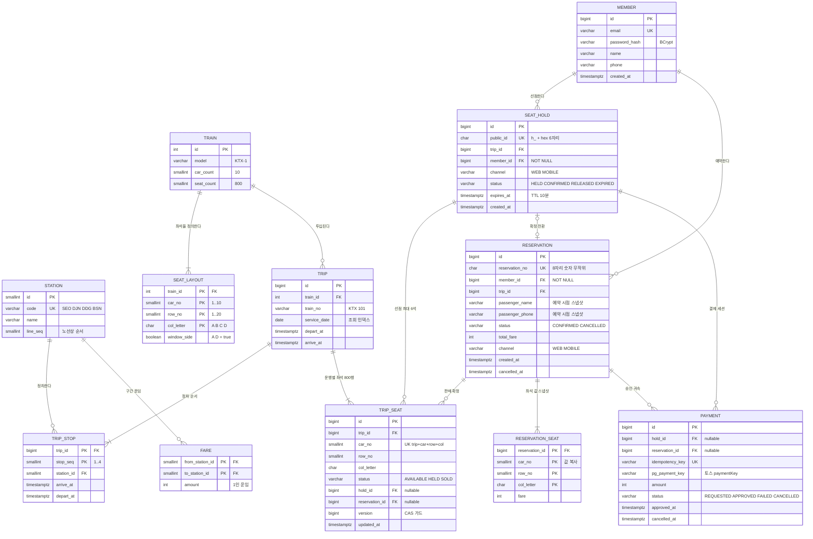
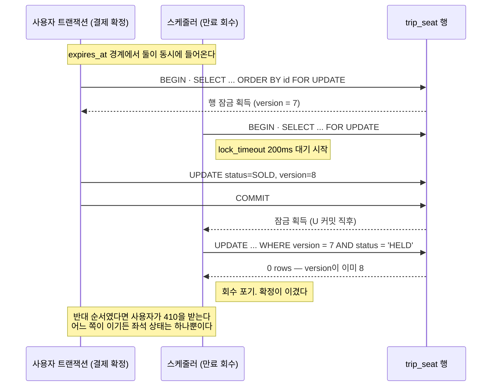
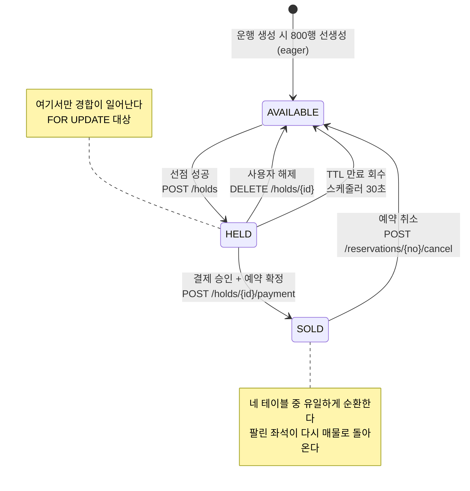
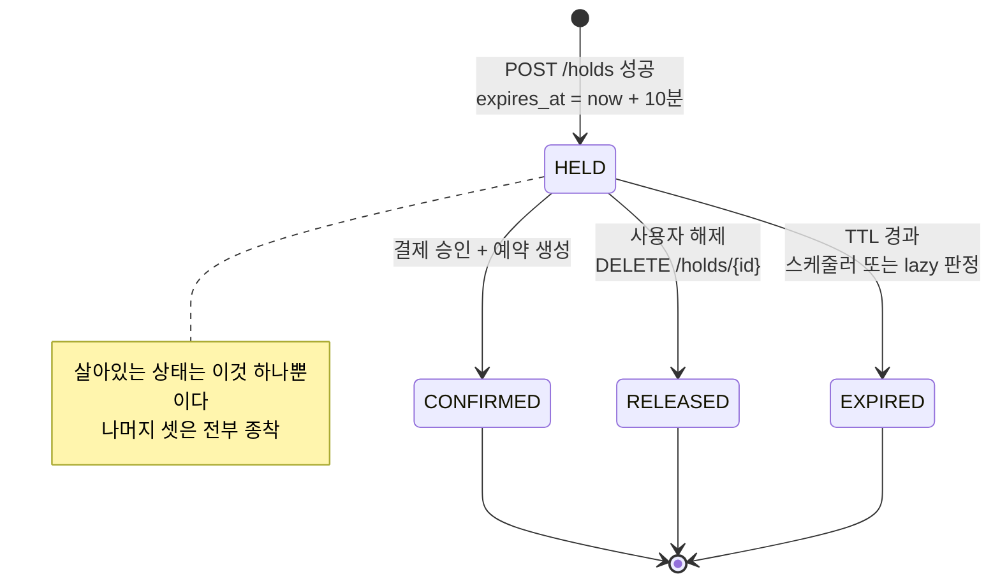
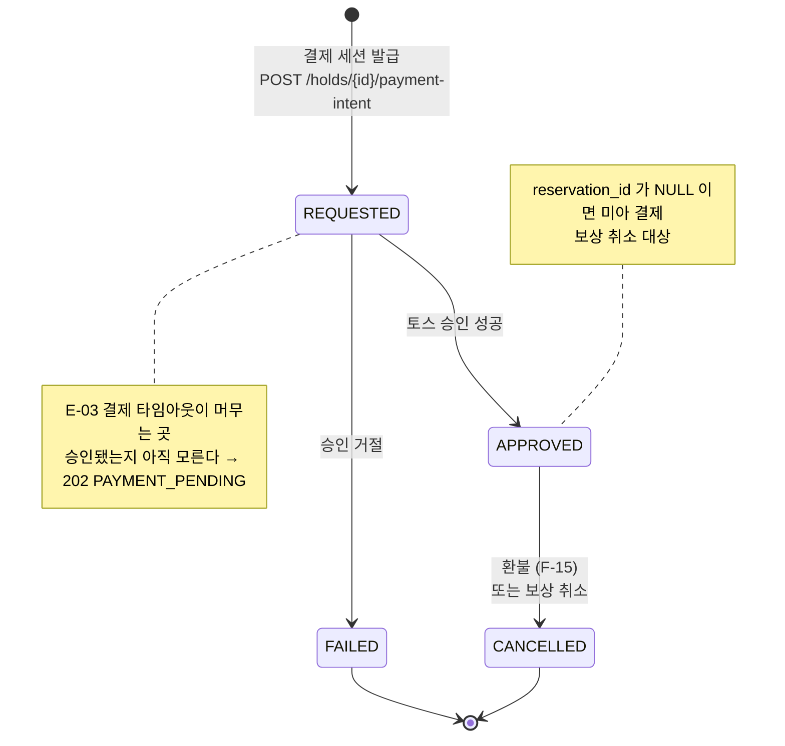

# 데이터 설계

PostgreSQL 17 · 확정일 2026-09-04

> **작성 범위** — **§0~§9 전체 완료.**
>
> **2026-09-04 키오스크 철회 반영.** `device` · `print_job` 테이블 제거, 비회원 예매 관련 컬럼 제거. 테이블 13 → 11개.
>
> **2026-09-10 `fare` 테이블 신설**(§3). 운임 출처가 없다는 구멍을 §7 시드 설계에서 발견했다. 테이블 11 → **12개**.

## §0 설계 원칙

| 원칙 | 내용 |
|---|---|
| **좌석의 진실은 PostgreSQL** | 선점·판매 판정은 여기서만 난다. Redis 좌석맵은 조회 가속용이며 **판정 근거가 아니다** |
| 락은 한 테이블에만 | `trip_seat` 외에는 비관적 락을 걸지 않는다 |
| 이력은 지우지 않는다 | 취소는 삭제가 아니라 상태 전이. 좌석은 반환하되 예약 기록은 남는다 |
| 도메인과 스키마는 분리 | 이 문서는 `:adapter-persistence`의 JPA 엔티티 형태다. `:domain`은 이걸 모른다 |

## §1 확정 사항

| # | 결정 | 값 |
|---|---|---|
| **A** | 좌석 행 생성 시점 | **eager** — 운행 생성 시 800행을 미리 만든다 |
| **B** | 좌석 주소 체계 | **호차 + 행 + 열** · 10호차 × 20행 × 4열(A·B·C·D) = **800석** |
| **C** | 시드 규모 | 4역 · 하루 20편 · 30일 = **600 운행 · 48만 좌석 행** |
| **D** | 중간역 | **4역 유지.** 좌석은 운행 전 구간을 통짜 점유 |

### A — 왜 eager인가

| | eager | lazy |
|---|---|---|
| 비관적 락 | `SELECT … FOR UPDATE` **그대로** | 잠글 행이 없어 `INSERT … ON CONFLICT`로 우회 |
| 좌석맵 조회 | 단순 `SELECT` | 좌석 정의 + 판매분 조합 |
| 데이터량 | 48만 행 | 수천 행 |

> **의도** — 48만 행은 PostgreSQL에 부담이 아니다. 저장 효율을 아끼려고 락 전략을 비트는 건 본말전도다. 이 프로젝트가 내건 게 비관적 락 + CAS 가드인데 lazy로 가면 그걸 보여줄 수 없다.

### B — 800석으로 잡은 이유

실물 KTX-1은 935석(특실 127 + 일반실 808)이다. **등급 없음**을 확정했으므로 특실을 뺀 808석이 기준이 되는데, 800석으로 맞추면 `10 × 20 × 4`로 딱 떨어져 시드 생성과 좌석 주소 계산이 단순해진다.

| 요소 | 값 |
|---|---|
| 호차 | 1 ~ 10 |
| 행 | 1 ~ 20 |
| 열 | `A` `B` · 통로 · `C` `D` |
| 창측 | `A` · `D` |
| 표기 | `4호차 7A` |

### D — 통짜 점유의 결과

구간 판매를 폐기했으므로 서울→대전 승객도 좌석 하나를 부산까지 잠근다. 4역을 유지하는 대가이자 이득이 하나 있다.

> **서로 다른 구간을 검색한 두 사용자가 같은 좌석을 두고 부딪힌다.** 서울→대전과 대전→부산 검색이 같은 운행을 반환하기 때문이다. 경합 시연에 쓸 카드가 하나 늘어난다.

---

## §2 ERD



### 이 그림에서 읽어야 할 것 4가지

| # | 판단 | 내용 |
|---|---|---|
| 1 | **`seat_hold_item`이 없다** | `trip_seat.hold_id` 하나로 양방향 조회가 다 된다. 중간 테이블을 두면 두 곳이 어긋날 여지만 생긴다 |
| 2 | **`reservation_seat`은 FK가 아니라 값 스냅샷** | `F-14`가 취소 시 좌석을 반환하되 예약 이력은 보존하라고 한다. `trip_seat`을 참조하면 반환 순간 이력이 사라진다 |
| 3 | **`trip_stop`을 분리했다** | 4역 유지 결정 때문이다. 서울→대전 검색이 서울→부산 운행을 찾으려면 정차역 목록이 필요하다 |
| 4 | **`payment`가 `hold`와 `reservation` 둘 다를 참조** | 결제는 **선점 상태에서 시작**하고 승인 후 예약에 귀속된다. 승인됐는데 확정에 실패한 건은 `reservation_id`가 `NULL`로 남아 보상 취소 대상이 된다 |

> **`trip_seat`이 이 스키마의 심장이다.** 48만 행 중 락이 걸리는 유일한 테이블이고, 상태·선점·예약·버전을 한 행에 모아 좌석 하나의 운명을 한 번의 `FOR UPDATE`로 결정한다.

---

## §3 테이블 정의

### 운행 계열

**`station`** — 역. 시드로만 채워지고 런타임 변경 없음.

| 컬럼 | 타입 | 제약 |
|---|---|---|
| `id` | `smallserial` | PK |
| `code` | `varchar(8)` | UNIQUE · `SEO` `DJN` `DDG` `BSN` |
| `name` | `varchar(32)` | NOT NULL |
| `line_seq` | `smallint` | NOT NULL · 노선 순서(1~4). 상·하행 판정에 쓴다 |

> **실제 코레일 역 코드(`stn_cd`)를 쓰지 않는다.** `SEO` `DJN`은 **로그와 URL에서 그대로 읽힌다.** 실제 코드가 필요해지면 `external_code` 컬럼 하나를 붙인다 — 컬럼 추가는 싸다.

**`fare`** — 구간 운임. **12행.**

| 컬럼 | 타입 | 제약 |
|---|---|---|
| `from_station_id` | `smallint` | PK · FK → `station` |
| `to_station_id` | `smallint` | PK · FK → `station` |
| `amount` | `int` | NOT NULL · `CHECK (amount > 0)` |

```sql
CHECK (from_station_id <> to_station_id)
```

**시드 값** — 실제 KTX 운임 근사값.

| 구간 | 운임 |
|---|---|
| 서울 ↔ 대전 | 23,700 |
| 서울 ↔ 동대구 | 43,500 |
| 서울 ↔ 부산 | **59,800** |
| 대전 ↔ 동대구 | 21,100 |
| 대전 ↔ 부산 | 39,400 |
| 동대구 ↔ 부산 | 17,100 |

> **6쌍이 아니라 12행이다.** 상·하행 운임이 같아도 순서쌍으로 저장하면 조회가 `WHERE from = ? AND to = ?` 하나로 끝난다. 6행으로 정규화하면 **매 조회마다 두 id를 정렬**해야 하고, 나중에 방향별 할인이 생기면 스키마를 다시 고쳐야 한다.

> **구간 판매는 폐기했지만 구간 운임은 필요하다.** 서울→대전 승객은 좌석을 부산까지 잠그되(§1-D) **요금은 대전까지만** 낸다. 수익 관점에선 손해지만 **우리는 수익 모델이 없고, 사용자에게 거짓말을 안 하는 쪽이 맞다.**

**`train`** — 편성 정의. 지금은 1행.

| 컬럼 | 타입 | 제약 |
|---|---|---|
| `id` | `serial` | PK |
| `model` | `varchar(32)` | `KTX-1` |
| `car_count` | `smallint` | 10 |
| `seat_count` | `smallint` | 800 |

**`seat_layout`** — 편성별 좌석 정의. 800행.

| 컬럼 | 타입 | 제약 |
|---|---|---|
| `train_id` | `int` | PK · FK → `train` |
| `car_no` | `smallint` | PK · 1~10 |
| `row_no` | `smallint` | PK · 1~20 |
| `col_letter` | `char(1)` | PK · `A` `B` `C` `D` |
| `window_side` | `boolean` | `A` `D` = true |

> **왜 `trip_seat`과 따로 두는가** — `seat_layout`은 *좌석이 무엇인가*(정의), `trip_seat`은 *이 운행에서 그 좌석이 어떤 상태인가*(상태)다. 지금은 편성이 하나라 중복처럼 보이지만, 시드 생성이 선언적이 되고 편성이 늘면 그대로 확장된다.

**`trip`** — 운행. 600행.

| 컬럼 | 타입 | 제약 |
|---|---|---|
| `id` | `bigserial` | PK |
| `train_id` | `int` | FK → `train` |
| `train_no` | `varchar(16)` | `KTX 101` |
| `service_date` | `date` | NOT NULL · 조회 인덱스 |
| `depart_at` | `timestamptz` | 시발역 출발 |
| `arrive_at` | `timestamptz` | 종착역 도착 |

인덱스 — `(service_date, depart_at)`

**`trip_stop`** — 운행 정차역. 600 × 4 = 2,400행.

| 컬럼 | 타입 | 제약 |
|---|---|---|
| `trip_id` | `bigint` | PK · FK → `trip` |
| `stop_seq` | `smallint` | PK · 1~4 |
| `station_id` | `smallint` | FK → `station` |
| `arrive_at` | `timestamptz` | 시발역은 NULL |
| `depart_at` | `timestamptz` | 종착역은 NULL |

인덱스 — `(station_id, trip_id)` · 구간 조회용

> **구간 조회 방식** — 출발역과 도착역이 모두 같은 `trip_id`에 존재하고 `출발 stop_seq < 도착 stop_seq`인 운행을 찾는다. 셀프 조인 한 번이면 된다. 뒤 조건이 없으면 **부산 → 서울** 검색에 하행 열차가 잡힌다.

### 좌석 상태 — 핵심

**`trip_seat`** — 운행별 좌석 상태. **48만 행.**

| 컬럼 | 타입 | 제약 |
|---|---|---|
| `id` | `bigserial` | PK |
| `trip_id` | `bigint` | FK → `trip` · NOT NULL |
| `car_no` | `smallint` | NOT NULL |
| `row_no` | `smallint` | NOT NULL |
| `col_letter` | `char(1)` | NOT NULL |
| `status` | `varchar(12)` | `AVAILABLE` · `HELD` · `SOLD` |
| `hold_id` | `bigint` | FK → `seat_hold` · **nullable** |
| `reservation_id` | `bigint` | FK → `reservation` · **nullable** |
| `version` | `bigint` | NOT NULL · 기본 0 · **CAS 가드** |
| `updated_at` | `timestamptz` | NOT NULL |

| 제약 · 인덱스 | 목적 |
|---|---|
| `UNIQUE (trip_id, car_no, row_no, col_letter)` | 좌석 주소 유일성 · **`trip_id` 접두로 좌석맵·집계까지 처리** |
| `INDEX (hold_id) WHERE hold_id IS NOT NULL` | **부분 인덱스** — 선점 회수 |
| `INDEX (reservation_id) WHERE reservation_id IS NOT NULL` | **부분 인덱스** — 예약 취소 |
| `CHECK` | **상태별 참조가 정확히 하나이거나 없다** — §5.1 |

> ⚠️ **`(trip_id, status)` 인덱스를 두지 않는다.** `status`는 이 시스템에서 가장 자주 바뀌는 컬럼이라, 인덱스를 걸면 **경합이 심할수록 유지 비용이 커진다** — 락을 쥔 구간에 짐을 얹는 꼴이다. 근거는 §8.9.

> **좌석 주소를 `seat_layout`에서 복사해 온 이유** — 좌석맵 조회가 이 시스템에서 가장 자주 실행되는 쿼리다. 800석을 화면에 뿌릴 때마다 조인하면 비용이 48만 행 규모로 붙는다. 주소 3개 컬럼을 복사해두면 `WHERE trip_id = ?` 하나로 끝난다.

### 예매 계열

**`seat_hold`** — 선점.

| 컬럼 | 타입 | 제약 |
|---|---|---|
| `id` | `bigserial` | PK |
| **`public_id`** | **`char(8)`** | **UNIQUE** · `h_` + hex 6자리 (`h_8f3a21`) |
| `trip_id` | `bigint` | FK → `trip` |
| `member_id` | `bigint` | FK → `member` · **NOT NULL** |
| `channel` | `varchar(8)` | `WEB` · `MOBILE` |
| `status` | `varchar(12)` | `HELD` · `CONFIRMED` · `RELEASED` · `EXPIRED` |
| `expires_at` | `timestamptz` | NOT NULL · 생성 + 10분 |
| `created_at` | `timestamptz` | NOT NULL |

인덱스 — **`(expires_at) WHERE status = 'HELD'`** · 만료 회수 스케줄러(`F-07`)가 쓴다
· UNIQUE **`(public_id)`** · API 경로 조회

> **`public_id`가 왜 있나** — `GET /holds/{holdId}`의 경로 키다. `reservation_no`와 **같은 판단**이다(§3 예매 계열): **내부 `bigserial`을 URL에 노출하지 않는다.**
>
> ⚠️ **보안이 이유가 아니다.** 남의 선점은 `403 HOLD_NOT_OWNED`가 막는다(`F-31`). 이유는 **DTO 경계**다 — 내부 PK가 밖으로 나가면 그 값에 의존하는 클라이언트가 생기고, PK 전략을 못 바꾸게 된다.
>
> **충돌은 UNIQUE가 잡는다.** hex 6자리 = 1,677만. 생성 시 충돌하면 다시 뽑는다. 종착 상태 3개가 누적되는 테이블이라(§5.2) **영원히 안전하진 않지만**, 이 프로젝트 규모에서 재시도 한 번이면 충분하다.

> **부분 인덱스인 이유** — 종착 상태가 3개라(§5.2) 시간이 갈수록 `CONFIRMED` · `RELEASED` · `EXPIRED`가 쌓이고 **`HELD`는 항상 소수**다. 인덱스 크기가 **누적이 아니라 현재 부하에 비례**한다. 근거는 §8.6.

**`reservation`** — 예약.

| 컬럼 | 타입 | 제약 |
|---|---|---|
| `id` | `bigserial` | PK |
| `reservation_no` | `char(8)` | **UNIQUE** · 8자리 숫자 무작위 |
| `member_id` | `bigint` | FK → `member` · **NOT NULL** |
| `trip_id` | `bigint` | FK → `trip` |
| `passenger_name` | `varchar(32)` | NOT NULL · **예약 시점 스냅샷** |
| `passenger_phone` | `varchar(20)` | NOT NULL · **예약 시점 스냅샷** |
| `status` | `varchar(12)` | `CONFIRMED` · `CANCELLED` — **`COMPLETED`는 저장 안 함(§5.5)** |
| `total_fare` | `int` | NOT NULL |
| `channel` | `varchar(8)` | `WEB` · `MOBILE` |
| `created_at` · `cancelled_at` | `timestamptz` | |

인덱스 — `(member_id, created_at DESC)` · 예약 목록(`F-12`)

> **왜 이름·연락처를 `member`에서 조인하지 않고 복사하는가** — 회원이 나중에 이름이나 연락처를 바꿔도(`F-22`) **예약 당시의 승객 정보는 그대로 남아야** 한다. 조인하면 과거 예약의 승객 이름이 소급해서 바뀐다.

**`reservation_seat`** — 예약 좌석 **값 스냅샷**.

| 컬럼 | 타입 | 제약 |
|---|---|---|
| `reservation_id` | `bigint` | PK · FK → `reservation` |
| `car_no` · `row_no` · `col_letter` | | PK · **값 복사. `trip_seat` FK 아님** |
| `fare` | `int` | NOT NULL |

> **왜 FK가 아닌가** — `F-14` 취소는 좌석을 즉시 `AVAILABLE`로 되돌리고 그 좌석은 다른 사람에게 팔린다. `trip_seat`을 참조하면 **취소된 예약이 남의 좌석을 가리키게 된다.** 이력 보존이 요구사항이므로 그 시점의 값을 복사해 둔다.

### 결제 · 회원

**`payment`**

| 컬럼 | 타입 | 제약 |
|---|---|---|
| `id` | `bigserial` | PK |
| `hold_id` | `bigint` | FK → `seat_hold` · nullable |
| `reservation_id` | `bigint` | FK → `reservation` · **nullable** |
| `idempotency_key` | `varchar(64)` | **UNIQUE** |
| `pg_payment_key` | `varchar(64)` | 토스 `paymentKey` |
| `amount` | `int` | NOT NULL |
| `status` | `varchar(12)` | `REQUESTED` · `APPROVED` · `FAILED` · `CANCELLED` |
| `approved_at` · `cancelled_at` | `timestamptz` | |

> **`reservation_id`가 nullable인 이유** — `F-08` 6단계(승인됐는데 확정 실패)를 표현하기 위해서다. `status='APPROVED' AND reservation_id IS NULL`인 행이 **보상 취소 대상**이며, 이 조건 하나로 미아 결제를 찾아낼 수 있다.

**`member`**

| 컬럼 | 타입 | 제약 |
|---|---|---|
| `id` | `bigserial` | PK |
| `email` | `varchar(120)` | UNIQUE |
| `password_hash` | `varchar(60)` | BCrypt cost 10~12 |
| `name` · `phone` | | NOT NULL |
| `created_at` | `timestamptz` | |

> Refresh 토큰과 로그인 시도 제한은 **여기 없다.** Redis에 있다(§8 예정).

## 규모 요약

| 테이블 | 행 수 |
|---|---|
| `station` | 4 |
| `train` | 1 |
| **`fare`** | **12** |
| `seat_layout` | 800 |
| `trip` | 600 |
| `trip_stop` | 2,400 |
| **`trip_seat`** | **480,000** |
| `member` · `seat_hold` · `reservation` · `reservation_seat` · `payment` | 런타임 발생분 |

**테이블 12개.**

### 키오스크 철회로 제거된 것

| 대상 | 내용 |
|---|---|
| `device` 테이블 | 디바이스 코드 · mTLS 인증서 지문 · 하트비트 · 프린터 상태 |
| `print_job` 테이블 | 출력 이력 · 실패 사유 |
| `seat_hold.holder_type` · `.device_id` | 회원만 선점하므로 불필요 |
| `reservation.lookup_pin_hash` | 비로그인 조회가 사라져 조회 PIN 소멸 |
| `member_id` nullable | **NOT NULL로 승격** — 비회원 예약이 없다 |
| `channel` 값 `KIOSK` | `WEB` · `MOBILE`만 |

---

## §4 동시성 설계

이 문서의 본론. **초과 판매 0건**을 만드는 장치가 전부 여기 모인다.

| 확정 | 값 |
|---|---|
| 락 범위 | 선택한 **좌석 행만** |
| 잠금 순서 | `trip_seat.id` **오름차순** · 테이블 간 `trip_seat → seat_hold → reservation` |
| 대기 정책 | `FOR UPDATE` + **`lock_timeout` 200ms** |
| CAS 가드 | `trip_seat.version` — 락 밖 판단 경로 방어 |
| 트랜잭션 경계 | **`TransactionRunner` 포트** (`:application` 선언, 어댑터 구현) |
| 이벤트 발행 | **커밋 후 직접 발행** (`afterCommit`) |
| 격리 수준 | `READ COMMITTED` (PostgreSQL 기본) |

### 4.1 락 범위 — 좌석 행만 잠근다

| 안 | 방식 | 판정 |
|---|---|---|
| **선택 좌석 행만** | `WHERE id = ANY(?)` · 최대 6행 | ✅ **채택** |
| 운행 전체 | `pg_advisory_xact_lock(trip_id)` | ❌ 운행 하나가 직렬화된다. 800석짜리 열차의 처리량이 1로 떨어진다 |

> **의도** — 경합은 **좌석 단위**로 일어난다. 7A를 두고 싸우는 두 사람이 3C를 사려는 사람을 막을 이유가 없다. 락 범위를 넓히면 정합성은 쉬워지지만 이 프로젝트가 측정하려는 처리량이 사라진다.

`trip_seat` 외에는 비관적 락을 걸지 않는다. `seat_hold` · `reservation`은 대부분 INSERT거나 본인 행 UPDATE라 경합 대상이 아니다.

### 4.2 잠금 순서 — 데드락은 여기서 막는다

```
요청 A: [7A, 7B]              요청 B: [7B, 7A]
  ① 7A 잠금 성공                ① 7B 잠금 성공
  ② 7B 대기 ───────┐   ┌──────── ② 7A 대기
                   └─X─┘
                  서로 영원히 기다림
```

**해결은 한 줄이다 — 항상 같은 순서로 잠근다.**

```sql
SELECT id, status, hold_id, reservation_id, version
  FROM trip_seat
 WHERE trip_id = ?
   AND id = ANY(?)          -- 애플리케이션이 이미 정렬해서 넘긴다
 ORDER BY id                -- ← 이게 없으면 데드락
   FOR UPDATE;
```

| 규칙 | 내용 |
|---|---|
| 좌석 간 | `id` 오름차순. **SQL의 `ORDER BY`와 애플리케이션 정렬 양쪽에서 강제** |
| 테이블 간 | **`trip_seat` → `seat_hold` → `reservation`** 순서 고정 |

> **왜 양쪽에서 정렬하나** — `ORDER BY`만으로도 대개 동작하지만 플래너가 스캔 순서를 바꿀 여지가 있다. 애플리케이션에서도 좌석 ID를 정렬해 넘기면 그 여지가 사라지고, 코드만 읽어도 의도가 보인다.
>
> **테이블 간 순서가 왜 필요한가** — 확정 경로는 `trip_seat` 잠그고 `seat_hold`를 갱신하는데, 만료 회수 경로가 반대로 하면 테이블 사이에서 데드락이 난다.

### 4.3 대기 정책 — `lock_timeout` 200ms

```sql
BEGIN;
SET LOCAL lock_timeout = '200ms';
SELECT ... FOR UPDATE;   -- 200ms 안에 못 잡으면 예외
```

| 후보 | 판정 |
|---|---|
| **`FOR UPDATE` + `lock_timeout`** | ✅ **채택.** 실제 락 보유 시간이 수 ms라 대부분 성공한다 |
| `FOR UPDATE NOWAIT` | ❌ 찰나의 겹침도 실패로 만든다. 체감 실패율이 불필요하게 높다 |
| `FOR UPDATE SKIP LOCKED` | ❌ **부분 성공이 생긴다.** "전부 성공 또는 전부 실패"와 정면 충돌 |

| 항목 | 값 |
|---|---|
| 초기값 | **200ms** — 실측 후 조정 |
| 타임아웃 시 | 트랜잭션 롤백 → `409` + **실패 좌석 목록** |
| 설정 위치 | `SET LOCAL` — 해당 트랜잭션에만 적용 |

> **`SKIP LOCKED`를 못 쓰는 게 이 시스템의 특징이다.** 대기열이나 작업 큐라면 잠긴 행을 건너뛰는 게 정답이지만, 6석을 한 덩어리로 잡아야 하는 여기서는 건너뛰는 순간 규칙이 깨진다.

### 4.4 CAS 가드 — 비관적 락이 있는데 `version`이 왜 필요한가

락은 **한 트랜잭션 창 안에서만** 보호한다. 창 밖에서 읽은 값으로 판단하는 경로가 하나 있다 — **만료 회수 스케줄러**다.

```
① 스케줄러: 만료 대상 조회        (version = 7 을 읽음)
                ↓  ← 이 사이에 사용자가 결제를 확정한다
② 스케줄러: 회수 UPDATE 시도      (version 이 이미 8)
```

```sql
UPDATE trip_seat
   SET status = 'AVAILABLE', hold_id = NULL,
       version = version + 1, updated_at = now()
 WHERE id = ?
   AND version = ?          -- ← 읽었을 때의 값
   AND status = 'HELD';
```

**영향 행이 0이면 남이 먼저 바꾼 것이다.** 회수를 포기하고 다음 대상으로 넘어간다.

> **의도** — 락과 CAS는 경쟁 관계가 아니라 **역할이 다르다.** 락은 선점 경로(짧은 트랜잭션)를 지키고, CAS는 조회와 갱신 사이에 시간이 벌어지는 경로(스케줄러)를 지킨다. 둘 중 하나만 있으면 구멍이 남는다.

### 4.5 만료 회수 ↔ 결제 확정 경쟁

`expires_at` 경계에서 둘이 같은 행을 노린다.



| 경로 | 조건 |
|---|---|
| 확정 | `status='HELD' AND expires_at > now()` |
| 회수 | `status='HELD' AND expires_at <= now()` |
| 조회 시 lazy 판정 | `expires_at`이 지났으면 `HELD`여도 만료로 취급 |

> **어느 쪽이 이겨도 정합적이다.** 확정이 이기면 티켓이 나가고, 회수가 이기면 사용자가 `410`을 받는다. **둘 다 일어나는 경우는 없다** — 그게 이 설계의 목표다.
>
> lazy 판정이 필요한 이유는 스케줄러가 30초 주기라서다. 만료된 지 25초 된 선점을 조회하면 DB에는 아직 `HELD`인데, 그걸 유효하다고 답하면 안 된다.

### 4.6 트랜잭션 경계 — `TransactionRunner` 포트

`:application`은 **Spring 의존 0**이다. `@Transactional`을 쓸 수 없다.

```java
// :application  — 인터페이스만 선언
public interface TransactionRunner {
    <T> T inTransaction(Supplier<T> work);
}
```

```java
// :adapter-persistence — Spring이 여기 있다
@Component
class SpringTransactionRunner implements TransactionRunner {
    private final TransactionTemplate tx;

    @Override public <T> T inTransaction(Supplier<T> work) {
        return tx.execute(status -> work.get());
    }
}
```

```java
// :application  — 유스케이스
public HoldResult reserve(ReserveSeatsCommand cmd) {
    return txRunner.inTransaction(() -> {
        var seats = seatRepository.lockForUpdate(cmd.tripId(), cmd.sortedSeatIds());
        var hold  = Hold.open(cmd.tripId(), cmd.seats(), clock.now());  // :domain 규칙
        seatRepository.markHeld(seats, hold.id());
        return HoldResult.of(hold);
    });
}
```

| 선택지 | 왜 안 골랐나 |
|---|---|
| `jakarta.transaction.Transactional` | Spring은 아니지만 `:application`에 외부 의존이 생긴다 |
| 어댑터에 `@Transactional` | 경계가 너무 바깥. `:adapter-web`과 `:adapter-scheduling` 양쪽에 중복 |
| `:bootstrap` AOP 구성 | 경계가 코드에 안 보인다 |

> **대가는 장황함이다.** `@Transactional` 한 줄이 람다 한 겹으로 바뀐다. 대신 `:application/build.gradle.kts`에 Spring이 없다는 사실이 유지되고, **트랜잭션 경계가 코드에 명시적으로 드러난다** — 어디서 시작하고 끝나는지 보인다.

`lock_timeout`도 이 어댑터 구현에서 건다 — 코어는 그런 게 있는 줄 모른다.

### 4.7 이벤트 발행 — 커밋 후

좌석이 바뀌면 두 가지를 해야 한다. **Redis 캐시 무효화**와 **SSE 팬아웃 발행**.

| 시점 | 문제 |
|---|---|
| 커밋 **전** | 롤백되면 **유령 이벤트** — 안 팔린 좌석이 팔린 것처럼 전파된다 |
| 커밋 **후** | ✅ 채택. 발행이 실패하면 DB와 화면이 잠깐 어긋난다 |

**코어는 이 타이밍을 모른다.**

```java
// :application — 그냥 "발행해줘"라고만 한다
seatEventPublisher.publish(SeatChanged.of(tripId, changedSeats));
```

```java
// :adapter-cache — 커밋될 때까지 버퍼링한다
@Override public void publish(SeatChanged event) {
    TransactionSynchronizationManager.registerSynchronization(
        new TransactionSynchronization() {
            @Override public void afterCommit() {
                redis.del(seatMapKey(event.tripId()));      // 캐시 무효화
                redis.convertAndSend(channel(event), event); // SSE 팬아웃
            }
        });
}
```

| 발행 실패 시 | 복구 경로 |
|---|---|
| 캐시가 안 지워짐 | 캐시 TTL(짧게)로 자연 만료 |
| SSE가 안 나감 | 클라이언트 재연결 시 전체 재조회 (`F-19`) · 모바일 백그라운드 복귀 |

> **의도 — 캐시 무효화와 SSE 발행을 한 곳에서 한다.** 두 경로로 나누면 "화면은 바뀌었는데 캐시는 옛날 값"이 생긴다. 같은 `afterCommit` 블록 안에 둬서 구조적으로 갈라지지 않게 했다.
>
> **Outbox 패턴은 확장 후보다.** 정합성은 더 강하지만 테이블 1개와 워커 1개가 늘고, 지금 규모에서는 TTL과 재조회로 충분히 복구된다.

### 4.8 격리 수준 — `READ COMMITTED`

PostgreSQL 기본값을 그대로 쓴다.

| 수준 | 판정 |
|---|---|
| **`READ COMMITTED`** | ✅ **비관적 락을 쓰므로 충분하다.** `FOR UPDATE`가 필요한 직렬성을 이미 준다 |
| `REPEATABLE READ` | ❌ 직렬화 실패(`40001`)가 나서 **애플리케이션 재시도 루프**가 필요해진다 |

> **의도** — 격리 수준을 올려 해결하려 들면 재시도 로직이라는 새 복잡도가 생기고, 실패 원인이 "락 경합"에서 "직렬화 충돌"로 옮겨갈 뿐이다. 명시적인 락이 무슨 일이 일어나는지 더 잘 보여준다.

### 4.9 검증 — 초과 판매 0건을 어떻게 증명하나

**경합 시나리오** — 측정 도구는 미정이지만, **무엇을 확인해야 하는지는 지금 정해둔다.**

| 시나리오 | 내용 |
|---|---|
| 단일 좌석 폭주 | 같은 좌석 1석에 동시 N건 → **정확히 1건만 201, 나머지 409** |
| 6석 원자성 | 겹치는 좌석 집합에 동시 요청 → **부분 성공 0건** |
| 만료 경쟁 | TTL 경계에 결제 확정 주입 → 확정 또는 410, **둘 다는 없음** |
| 결제 타임아웃 | 강제 지연 주입 → 멱등키 재조회로 **이중 결제 0건** |

**대사 쿼리** — 부하 후 DB에 직접 묻는다.

```sql
-- ① 초과 판매: 같은 좌석을 두 예약이 주장하는가
SELECT r.trip_id, rs.car_no, rs.row_no, rs.col_letter, count(*) AS claims
  FROM reservation_seat rs
  JOIN reservation r ON r.id = rs.reservation_id
 WHERE r.status = 'CONFIRMED'
 GROUP BY 1,2,3,4
HAVING count(*) > 1;
-- 기대: 0 rows
```

```sql
-- ② 상태 정합성: trip_seat 상태와 참조가 어긋난 행
SELECT id, status, hold_id, reservation_id FROM trip_seat
 WHERE (status = 'AVAILABLE' AND (hold_id IS NOT NULL OR reservation_id IS NOT NULL))
    OR (status = 'HELD'      AND hold_id IS NULL)
    OR (status = 'SOLD'      AND reservation_id IS NULL);
-- 기대: 0 rows
```

```sql
-- ③ 미아 결제: 승인됐는데 예약에 안 붙은 건
SELECT id, idempotency_key, amount FROM payment
 WHERE status = 'APPROVED' AND reservation_id IS NULL;
-- 기대: 0 rows (보상 취소가 돌았다면)
```

| 관측 지표 | 출처 |
|---|---|
| 데드락 발생 수 | `pg_stat_database.deadlocks` — **0이어야 한다** |
| 락 타임아웃 비율 | 애플리케이션 `409` 중 타임아웃 사유 비중 |
| 락 대기 시간 | `pg_stat_activity.wait_event_type = 'Lock'` |

> **①번 쿼리가 이 프로젝트의 최종 증거다.** `reservation_seat`을 FK가 아니라 **값 스냅샷**으로 둔 §3의 결정이 여기서 검증 도구가 된다 — 좌석이 반환된 뒤에도 "누가 무엇을 주장했는지"가 남아 있어 사후 대사가 가능하다.

---

## §5 상태 전이

상태를 가진 테이블은 4개다. **엔드포인트 스펙(`api.md` §5)이 이 절에 의존한다** — 어떤 호출이 어떤 전이를 일으키는지가 곧 API 계약이다.

| 테이블 | 상태 | 순환 |
|---|---|---|
| **`trip_seat`** | `AVAILABLE` `HELD` `SOLD` | ✅ **유일하게 순환한다** |
| `seat_hold` | `HELD` `CONFIRMED` `RELEASED` `EXPIRED` | ❌ 종착 3개 |
| `reservation` | `CONFIRMED` `CANCELLED` | ❌ |
| `payment` | `REQUESTED` `APPROVED` `FAILED` `CANCELLED` | ❌ |

> **상태 머신은 `:domain`이 소유한다.** `Hold.confirm()`이 전이를 판정하지 HTTP가 판정하는 게 아니다. `api.md`는 이 표를 참조만 한다 — §4에서 "상태 코드 매핑은 어댑터에만"이라고 정한 것과 같은 원리다.

### 5.1 `trip_seat` — 좌석의 일생



| # | 전이 | 트리거 | 가드 | 부수효과 |
|---|---|---|---|---|
| 1 | `AVAILABLE` → `HELD` | `POST /holds` | `status='AVAILABLE'` · **6석 전부** | `hold_id` 설정 · `version+1` · SSE |
| 2 | `HELD` → `AVAILABLE` | `DELETE /holds/{id}` | 내 선점 · `status='HELD'` | `hold_id=NULL` · `version+1` · SSE |
| 3 | `HELD` → `AVAILABLE` | 스케줄러 | `expires_at <= now()` · **`version` 일치** | `hold_id=NULL` · `version+1` · SSE |
| 4 | `HELD` → `SOLD` | 결제 승인 성공 | `expires_at > now()` · `status='HELD'` | `reservation_id` 설정 · **`hold_id=NULL`** · SSE |
| 5 | `SOLD` → `AVAILABLE` | 예약 취소 | `reservation.status='CONFIRMED'` · 출발 전 | `reservation_id=NULL` · `version+1` · SSE |

> **전이 4에서 `hold_id`를 `NULL`로 비운다.** 좌석이 팔린 뒤에도 선점 참조를 들고 있으면 "이 좌석은 SOLD인데 HELD 흔적도 있다"는 애매한 행이 남는다. **선점 이력은 `seat_hold`가 `CONFIRMED`로 보관**하므로 잃는 정보가 없다.
>
> 그래서 §3의 `CHECK` 제약이 이렇게 강화된다 — **어느 상태든 참조는 정확히 하나이거나 없다.**

```sql
CHECK (
  (status = 'AVAILABLE' AND hold_id IS NULL     AND reservation_id IS NULL) OR
  (status = 'HELD'      AND hold_id IS NOT NULL AND reservation_id IS NULL) OR
  (status = 'SOLD'      AND hold_id IS NULL     AND reservation_id IS NOT NULL)
)
```

> **전이 2와 3은 결과가 같지만 다른 전이다.** 2는 사용자가 능동적으로 놓은 것, 3은 시간이 지나 뺏긴 것이다. `seat_hold`가 각각 `RELEASED` · `EXPIRED`로 갈라져 그 차이를 기록한다. 좌석만 보면 구분이 안 된다.

### 5.2 `seat_hold` — 선점의 일생



| # | 전이 | 트리거 | 가드 | 대응 `trip_seat` |
|---|---|---|---|---|
| 1 | → `HELD` | `POST /holds` | 좌석 6석 전부 확보 | 전이 1 |
| 2 | `HELD` → `CONFIRMED` | 결제 승인 성공 | `expires_at > now()` | 전이 4 |
| 3 | `HELD` → `RELEASED` | `DELETE /holds/{id}` | 내 선점 | 전이 2 |
| 4 | `HELD` → `EXPIRED` | 스케줄러 · lazy 판정 | `expires_at <= now()` | 전이 3 |

> **종착 상태에서 나가는 전이가 없다.** `EXPIRED`된 선점을 되살리지 않는다 — 그 사이 좌석이 남에게 팔렸을 수 있어 되살릴 근거가 없다. 사용자는 **새 선점을 만든다.**

**lazy 판정** — 스케줄러가 30초 주기라 만료된 지 25초 된 선점은 DB에 아직 `HELD`다. **조회·확정 시점에 `expires_at`을 다시 보고 만료로 취급**한다. 저장 상태와 논리 상태가 최대 30초 어긋날 수 있다는 뜻이고, 그 창을 lazy 판정이 메운다.

### 5.3 `payment` — 결제 시도



| # | 전이 | 트리거 | 가드 | 비고 |
|---|---|---|---|---|
| 1 | → `REQUESTED` | **결제 세션 발급** (`payment-intent`) | 선점이 살아있을 것 | `order_id` · `amount`를 여기서 못박는다 |
| 2 | `REQUESTED` → `APPROVED` | 토스 승인 성공 (`payment`) | **`amount` 일치** · `Idempotency-Key` 신규 | `reservation` 생성 시도. 같은 키 재요청은 **이전 결과 재생** |
| 3 | `REQUESTED` → `FAILED` | 승인 거절 | — | **선점은 유지** — 재시도 가능 |
| 4 | `APPROVED` → `CANCELLED` | 환불 · 보상 취소 | `reservation_id IS NULL` (보상) 또는 취소 요청 | `F-15`는 P1 |

> **`REQUESTED`에 머무는 것이 곧 "미확정"이다.** 별도 `PENDING` 상태를 두지 않는다 — 상태를 늘리면 "요청했다"와 "요청했는데 답이 없다"를 구분해 저장해야 하는데, 그 구분은 **경과 시간으로 파생**할 수 있다.

### 5.4 `reservation` — 전이가 하나뿐이다

다이어그램을 그리지 않는다. **실제 전이가 하나라 표가 더 정확하다.**

| # | 전이 | 트리거 | 가드 | 부수효과 |
|---|---|---|---|---|
| 1 | → `CONFIRMED` | 결제 승인 후 생성 | — | `reservation_seat` 스냅샷 생성 |
| 2 | `CONFIRMED` → `CANCELLED` | `POST /reservations/{no}/cancel` | 본인 · **출발 시각 이전** | 좌석 반환 · `cancelled_at` 기록 |

### 5.5 저장하지 않는 상태 — `COMPLETED`

§3 초안에는 `COMPLETED`가 상태 값으로 있었다. **뺀다.**

| | 저장할 때 | **파생할 때 (채택)** |
|---|---|---|
| 필요한 것 | 출발 시각마다 도는 **배치** | 없음 |
| 진실 | `status` 컬럼 | **`trip.depart_at < now()`** |
| 위험 | 배치가 안 돌면 상태가 거짓 | 없음 |

```sql
-- 조회 시 파생한다
CASE WHEN r.status = 'CONFIRMED' AND t.depart_at < now()
     THEN 'COMPLETED' ELSE r.status END
```

> **이미 알 수 있는 걸 저장하지 않는다.** "출발했다"는 사실은 `trip.depart_at`에 이미 있다. 상태 컬럼에 복제하면 배치 하나가 늘고, 그 배치가 밀리는 순간 DB가 거짓말을 한다.
>
> API 응답에는 `COMPLETED`가 그대로 나간다 — **클라이언트는 파생인지 저장인지 알 필요가 없다.**

### 5.6 함께 일어나는 전이 — 트랜잭션 묶음

전이는 혼자 일어나지 않는다. **한 유스케이스가 여러 테이블을 같은 트랜잭션에서 바꾼다.**

| 유스케이스 | 같은 트랜잭션에서 바뀌는 것 | 테이블 수 |
|---|---|---|
| 선점 | `trip_seat` ×N `AVAILABLE→HELD` + `seat_hold` 생성 | 2 |
| 해제 | `trip_seat` ×N `HELD→AVAILABLE` + `seat_hold` `→RELEASED` | 2 |
| 만료 회수 | `trip_seat` ×N `HELD→AVAILABLE` + `seat_hold` `→EXPIRED` | 2 |
| **확정** | `trip_seat` `→SOLD` + `seat_hold` `→CONFIRMED` + `reservation` 생성 + `reservation_seat` 생성 + `payment` `→APPROVED` | **5** |
| 취소 | `trip_seat` `→AVAILABLE` + `reservation` `→CANCELLED` (+`payment` `→CANCELLED`) | 2~3 |

> **확정이 가장 무겁다 — 5개 테이블이 한 트랜잭션에 묶인다.** 그래서 §4의 **테이블 간 잠금 순서**(`trip_seat → seat_hold → reservation`)가 여기서 실제로 쓰인다. 순서를 안 정하면 확정과 만료 회수가 테이블 사이에서 데드락을 만든다.

### 5.7 가드 조건 총람

§4에 산문으로 흩어져 있던 조건을 한 표로 모은다. **빠진 게 있는지 여기서 검사한다.**

| 경로 | SQL 가드 | 실패 시 |
|---|---|---|
| 선점 | `status='AVAILABLE'` (6석 **전부**) | `409 SEAT_ALREADY_HELD` |
| 선점 (락) | `FOR UPDATE` · `lock_timeout 200ms` | `409 SEAT_LOCK_TIMEOUT` |
| 해제 | `hold.member_id = 나` · `status='HELD'` | `403 HOLD_NOT_OWNED` |
| **확정** | `status='HELD' AND expires_at > now()` | `410 HOLD_EXPIRED` |
| **회수** | `status='HELD' AND expires_at <= now()` **AND `version=?`** | 0 rows → 조용히 포기 |
| 취소 | `status='CONFIRMED' AND trip.depart_at > now()` | `409 RESERVATION_NOT_CANCELLABLE` |
| 결제 재시도 | `idempotency_key` 존재 여부 | 이전 결과 재생 또는 `409` |

> **확정과 회수의 가드가 `expires_at`을 기준으로 정확히 반대다.** 둘 중 하나만 참이므로 같은 좌석에 둘 다 성공할 수 없다. **회수에만 `version` CAS가 붙는 이유**는 §4.4 — 스케줄러는 조회와 갱신 사이에 시간이 벌어진다.

---

## §6 Redis — PostgreSQL 밖의 상태

> **[diagrams/redis-workloads.html](diagrams/redis-workloads.html)** — 이 절의 그림.

### 6.1 워크로드 4개 — 무엇이 캐시이고 무엇이 진실인가

| # | 워크로드 | 자료구조 | PG에 사본이 | 잃으면 |
|---|---|---|---|---|
| 1 | 좌석맵 캐시 | Hash | ✅ 있다 | **느려질 뿐** |
| 2 | SSE 이벤트 | Stream | ⚠️ **없다** (재개 창) | 재개 불가 |
| 3 | **Refresh 토큰** | String + Set | ❌ **없다** | **15분 뒤 전원 로그아웃** |
| 4 | **로그인 시도 제한** (`F-36`) | String | ❌ **없다** | 제한이 사라진다 |

> **§0 원칙 "좌석의 진실은 PostgreSQL"은 여전히 맞다. 하지만 "Redis는 캐시다"는 절반만 맞다.**
>
> 3·4번은 PostgreSQL에 사본이 없어 **Redis가 유일한 진실**이다. 이 구분을 안 하면 §6.7(장애 정책)과 §6.8(`maxmemory-policy`)에서 반드시 사고가 난다 — 캐시라고 생각하고 LRU를 켜는 순간 **로그인이 무작위로 풀린다.**

### 6.2 키 네이밍

| 규칙 | 내용 |
|---|---|
| 구분자 | `:` |
| 형태 | `{도메인}:{식별자}[:{하위}]` |
| 대소문자 | 소문자 · 스네이크 없음 |
| **금지** | **DB 번호로 논리 분리하지 않는다** — 접두사로만 구분 |

**전체 키 목록**

| 키 | 타입 | TTL | 성격 |
|---|---|---|---|
| `seatmap:{tripId}` | Hash | **5분** | 사본 |
| `trip:{tripId}:events` | Stream | 없음 (`MAXLEN`) | 준진실 |
| `refresh:{jti}` | String | **14일** | **진실** |
| `member:{memberId}:refresh` | Set | 14일 | **진실** |
| `login:fail:{email}` | String | **5분** | **진실** |

> **DB 번호(`SELECT 1`)를 안 쓰는 이유** — 클러스터가 지원하지 않고, 영속성·메모리 정책은 **어차피 인스턴스 단위**라 논리 분리로 얻는 게 없다. 얻는 건 "어느 DB였더라"는 운영 혼란뿐이다.

### 6.3 좌석맵 캐시

**Hash — 필드가 좌석 하나**

| 항목 | 값 |
|---|---|
| 키 | `seatmap:{tripId}` |
| 필드 | `{carNo}-{rowNo}-{colLetter}` — 예 `4-7-A` |
| 값 | `AVAILABLE` \| `HELD` \| `SOLD` |
| 필드 수 | **800** |
| TTL | **5분** (조회 시 갱신) |
| 적재 | **lazy** — 미스 시 PG에서 800행 읽어 `HSET` |

```
HGETALL seatmap:101          -- 조회
HSET    seatmap:101 4-7-A HELD 4-7-B HELD   -- 커밋 후 델타 갱신
EXPIRE  seatmap:101 300
```

> **String(JSON 통짜)이 아니라 Hash인 이유** — `HSET` 갱신 단위가 **SSE 델타와 정확히 같다.** `afterCommit` 블록에서 **바뀐 좌석 목록 하나로 `HSET`과 `XADD`를 둘 다** 한다. String이면 캐시는 800석 전체를, SSE는 델타를 만들어야 해서 **같은 사건에 두 가지 표현**이 생긴다.

**무효화가 아니라 갱신**

| | **갱신 (`HSET`)** | 무효화 (`DEL`) |
|---|---|---|
| 다음 조회 | 캐시 히트 | **PG 직격 — 미스 폭주** |
| 위험 | **서버 2대 순서 역전 가능** | 없음 |

> **순서 역전을 수용한다.** 서버 A의 `HELD`와 서버 B의 `AVAILABLE`(취소)이 역순으로 도착하면 캐시가 잠깐 틀린다. **그래도 안전한 이유는 판정을 PG가 하기 때문**이고, 그게 §0 원칙의 실제 이득이다.
>
> `api.md` §5.1도 좌석맵을 `snapshotAt` 붙은 **스냅샷**으로 정의했지 진실이라고 하지 않았다. **실시간 정확도는 SSE가 맡는다.**

**메모리 추정**

| 항목 | 값 |
|---|---|
| 필드 1개 | ~60 B |
| 운행 1개 | 800 × 60 ≈ **48 KB** |
| 동시 캐시 100 운행 | ≈ **5 MB** |

> 600 운행 전부를 캐시할 일이 없다. **TTL 5분 + lazy 적재**면 실제로 조회되는 몇십 개만 남는다.

### 6.4 이벤트 Stream

계약은 [api.md §6](api.md)에 있다. 여기서는 **저장 형태**만 정한다.

| 항목 | 값 |
|---|---|
| 키 | `trip:{tripId}:events` |
| 명령 | `XADD … MAXLEN ~ 1000` |
| 이벤트 ID | Redis가 생성 (`<ms>-<seq>`) — **그대로 클라에 노출** |
| 소비 | 서버마다 `XREAD BLOCK` (**Consumer Group 아님**) |
| 필드 | `cause` · `seats`(JSON) |

> **Consumer Group을 안 쓴다.** 그건 "여러 워커가 일을 나눠 갖는" 구조인데, 여기서는 **모든 서버가 모든 이벤트를 받아야** 자기 SSE 연결에 쓸 수 있다. 나눠 가지면 팬아웃이 깨진다.

> **`MAXLEN ~`(근사)를 쓴다.** 정확한 `MAXLEN`은 매 `XADD`마다 트리밍을 강제해 지연이 붙는다. `~`는 Redis가 편할 때 자르므로 실제 길이가 1000보다 조금 클 수 있고, **재개 창이 넉넉해지는 방향이라 손해가 없다.**

**메모리 추정** — 600 운행 × 1000건 × ~200 B ≈ **120 MB**가 최악값. 실제로는 판매가 일어난 운행만 쌓인다.

### 6.5 Refresh 토큰

| 키 | 타입 | 내용 |
|---|---|---|
| `refresh:{jti}` | String | `memberId` · TTL 14일 |
| `member:{memberId}:refresh` | Set | 그 회원의 살아있는 `jti` 목록 |

**회전 (`POST /auth/refresh`)**

```
1. GET refresh:{oldJti}        → 없으면 재사용 탐지로 (아래)
2. 새 jti 발급
3. SET  refresh:{newJti} memberId EX 1209600
4. SADD member:{id}:refresh {newJti}
5. DEL  refresh:{oldJti}
6. SREM member:{id}:refresh {oldJti}
```

**재사용 탐지** — 이미 폐기된 `jti`가 다시 오면

| 판정 | 조치 |
|---|---|
| **토큰 탈취 의심** | **해당 회원의 `jti` 전부 폐기** (`member:{id}:refresh` 순회 후 `DEL`) |
| 응답 | `401 INVALID_CREDENTIALS` |
| 로그 | **`WARN`** — `event=REFRESH_REUSE_DETECTED` |

> **재사용 탐지 없는 회전은 회전의 절반만 하는 것이다.** 회전의 목적이 "탈취된 토큰의 수명 단축"인데, 탈취범과 사용자가 번갈아 회전하면 **둘 다 무한히 갱신된다.** 폐기된 `jti`가 돌아오는 순간이 **유일한 탐지 기회**다.
>
> `member:{id}:refresh` Set이 필요한 이유도 이것뿐이다. 전체 폐기를 하려면 **그 회원의 토큰이 몇 개인지 알아야** 한다.

**로그아웃** (`F-25`) — `DEL refresh:{jti}` + `SREM`. Access 토큰은 **최대 15분 더 산다** — 그게 무상태 JWT의 대가다.

### 6.6 로그인 시도 제한 (`F-36`)

```
INCR   login:fail:{email}
EXPIRE login:fail:{email} 300 NX    -- 첫 실패에만 TTL을 건다
```

| 항목 | 값 |
|---|---|
| 임계 | **5회** |
| 차단 | **5분** · 자동 해제 |
| 성공 시 | `DEL` |
| 응답 | `429 TOO_MANY_ATTEMPTS` + **`Retry-After: 300`** |

> **`EXPIRE … NX`가 중요하다.** 매 실패마다 TTL을 새로 걸면 **공격자가 계속 시도하는 한 차단이 무한 연장**된다 — 그건 사실상 영구 잠금이고, `korail-auth.md` §6에서 "코레일을 그대로 베끼면 안 된다"고 한 이유가 사라진다. **첫 실패 시점부터 5분**이어야 한다.

> **키가 `email`이지 `memberId`가 아니다.** 없는 계정에도 카운트가 붙어야 **계정 존재 여부를 시도 횟수로 추론하는 것**을 막는다 (`api.md` §5.5 `INVALID_CREDENTIALS` 통일과 한 세트).

### 6.7 Redis 장애 시 동작

| 워크로드 | 정책 | 결과 |
|---|---|---|
| 좌석맵 캐시 | **fail-open** | **PG 폴백** — 느려질 뿐 |
| SSE Stream | **fail-open** | 실시간만 끊김. **예매는 된다** |
| Refresh 토큰 | **fail-closed** | 재발급 불가 (다른 선택지가 없다) |
| **시도 제한** | **fail-open** | **제한 없이 통과 + `WARN`** |

> **마지막 줄만 진짜 선택이다.** fail-closed면 Redis가 죽는 순간 **아무도 로그인을 못 한다** — 무차별 대입을 막으려다 서비스를 끄는 셈이다. fail-open을 택하되, **그 대가로 Redis 장애 창에서는 시도 제한이 없다**는 걸 여기 명시한다.
>
> **Refresh만 fail-closed인 건 선택이 아니라 사실이다.** 검증할 데이터가 없으면 통과시킬 방법이 없다. Redis 재시작 = **15분 안에 전원 재로그인**.

**핵심** — Redis가 죽어도 **좌석 예매 자체는 동작한다.** 판정도 트랜잭션도 PG에서 나기 때문이다.

### 6.8 인스턴스 설정

| 항목 | 값 | 이유 |
|---|---|---|
| 인스턴스 | **1대** | VM 자원. 클러스터는 과잉 |
| 영속성 | **AOF `everysec`** | **진실(토큰)이 있어서 필요하다** |
| RDB | 보조 (백업용 스냅샷) | |
| **`maxmemory-policy`** | **`noeviction`** | ⚠️ **아래 참조** |
| `maxmemory` | **256 MB** | 호스트가 8GB — §6.3 추정 5MB의 50배 |

> ⚠️ **`allkeys-lru`를 쓰면 안 된다.** 캐시 서버의 관행적 기본값이지만, 이 인스턴스에는 **버려도 되는 것(캐시)과 버리면 안 되는 것(토큰)이 섞여** 있고 **LRU는 그 둘을 구분하지 못한다.** 메모리가 차는 순간 Refresh 토큰이 evict되고, **로그인이 무작위로 풀리는데 원인을 찾기 어려운 종류의 사고**가 난다.
>
> `noeviction`이면 만차 시 **쓰기가 실패하고 읽기는 살아 있다.** 캐시 갱신이 실패해도 §6.7의 fail-open이 받아준다 — **실패가 가장 안전한 쪽으로 떨어진다.**
>
> 대신 **좌석맵에만 TTL을 걸어** 메모리가 자연히 회수되게 한다. `noeviction`에서 메모리를 관리하는 건 정책이 아니라 **TTL의 몫**이다.

### 6.9 이 절이 §0 원칙에 더하는 것

| §0 원칙 | §6이 붙이는 단서 |
|---|---|
| 좌석의 진실은 PostgreSQL | ✅ 그대로. **좌석에 한해서** |
| Redis 좌석맵은 판정 근거가 아니다 | ✅ 그대로 |
| — | ➕ **토큰과 시도 제한은 Redis가 유일한 진실이다** |

> **원칙을 고치지 않고 단서를 붙인다.** "좌석"이라는 한정어가 원래부터 붙어 있었고, 그 밖에 무엇이 있는지를 §6이 처음 밝혔을 뿐이다.

---

## §7 시드 데이터

> **[search/korail-trip-data.md](search/korail-trip-data.md)** — 이 절의 근거가 된 조사.

### 7.1 원칙

| 원칙 | 내용 |
|---|---|
| **Flyway는 스키마, 러너는 데이터** | 48만 행을 `.sql`에 박지 않는다 |
| **값이 아니라 규칙** | 생성기가 규칙을 표현한다. 값이 박제되면 바꿀 때마다 재작성 |
| **멱등** | 몇 번 돌려도 결과가 같다. 재기동이 48만 행을 다시 깔지 않는다 |
| **검증까지가 시드** | 넣고 끝이 아니라 **개수와 규칙을 대조**한다 |

> **Flyway에 48만 행을 넣으면 안 되는 이유** — 마이그레이션은 **스키마 버전**을 관리하는 도구다. 데이터를 섞으면 `V2__seed.sql`이 수십 MB가 되고, 시드 규칙을 하나 바꿀 때마다 **새 버전 파일을 또 만들어야** 한다. 스키마는 §9(Flyway), **데이터는 러너**로 나눈다.

### 7.2 생성 규모

| 테이블 | 행 수 | 생성 방식 |
|---|---|---|
| `station` | **4** | 상수 |
| `train` | **1** | 상수 |
| `fare` | **12** | 상수 (역 쌍) |
| `seat_layout` | **800** | `10 × 20 × 4` 중첩 |
| `trip` | **600** | `30일 × 20편` |
| `trip_stop` | **2,400** | `600 × 4역` |
| **`trip_seat`** | **480,000** | **`600 × 800`** |
| 합계 | **483,817** | |

### 7.3 생성 순서 — FK 의존이 곧 순서다

```
1. station                 (의존 없음)
2. train → seat_layout     (train_id FK)
3. fare                    (station FK ×2)
4. trip                    (train_id FK)
5. trip_stop               (trip_id · station_id FK)
6. trip_seat               (trip_id FK · seat_layout 값 복사)
```

> **순서를 고민할 필요가 없다는 게 스키마가 건강하다는 신호다.** FK 방향이 한쪽이면 위상 정렬이 유일하게 결정된다. 순환 참조가 있었다면 "무엇을 먼저 넣을지"부터 막혔을 것이다.

### 7.4 단계별 규칙

**① `station` — 4행**

| `code` | `name` | `line_seq` |
|---|---|---|
| `SEO` | 서울 | 1 |
| `DJN` | 대전 | 2 |
| `DDG` | 동대구 | 3 |
| `BSN` | 부산 | 4 |

**② `train` + `seat_layout` — 1 + 800행**

```
for car in 1..10:
  for row in 1..20:
    for col in [A, B, C, D]:
      seat_layout(train_id=1, car, row, col,
                  window_side = col in [A, D])
```

**③ `fare` — 12행** — §3의 운임표를 **양방향 전개**한다. 6쌍 × 2방향.

**④ `trip` — 600행** — 하루 20편 = **하행 10 + 상행 10**

| 항목 | 규칙 |
|---|---|
| 기간 | 오늘부터 **30일** (`service_date`) |
| 하행 (서울→부산) | 06:00부터 **90분 간격** 10편 |
| 상행 (부산→서울) | 07:00부터 90분 간격 10편 |
| 소요 | **2시간 17분** 고정 |
| `train_no` | **§7.5 참조** |

**⑤ `trip_stop` — 2,400행** — 운행마다 4역 전부. 하행은 `line_seq` 오름차순, 상행은 내림차순.

| `stop_seq` | 하행 | 상행 |
|---|---|---|
| 1 | 서울 (`arrive_at` NULL) | 부산 |
| 2 | 대전 | 동대구 |
| 3 | 동대구 | 대전 |
| 4 | 부산 (`depart_at` NULL) | 서울 |

**⑥ `trip_seat` — 480,000행** — `trip` 600 × `seat_layout` 800

```sql
INSERT INTO trip_seat (trip_id, car_no, row_no, col_letter, status, version)
SELECT t.id, l.car_no, l.row_no, l.col_letter, 'AVAILABLE', 0
  FROM trip t CROSS JOIN seat_layout l
 WHERE l.train_id = t.train_id;
```

> **⑥은 애플리케이션이 아니라 DB가 만든다.** 48만 행을 러너가 한 줄씩 조립해 보낼 이유가 없다 — **`CROSS JOIN` 한 방**이면 PostgreSQL이 내부에서 끝낸다. 러너의 역할은 "이 SQL을 언제 실행할지"를 정하는 것이지 행을 나르는 게 아니다.
>
> 나머지 ①~⑤는 **규칙이 복잡하고 행이 적어서** 애플리케이션 쪽이 낫다. **행이 많고 규칙이 단순하면 DB, 행이 적고 규칙이 복잡하면 애플리케이션** — 이 경계가 시드 설계의 전부다.

### 7.5 열차번호 규칙

실제 코레일 체계를 따른다 (`korail-trip-data.md` §1).

| 방향 | 번호 | 예 |
|---|---|---|
| **하행** (서울→부산) | **홀수** | `KTX 101` `103` … `119` |
| **상행** (부산→서울) | **짝수** | `KTX 102` `104` … `120` |

> **공짜로 얻는 현실성이다.** 그리고 **번호 홀짝이 `trip_stop` 순서와 일치하는지**가 §7.8 검증 쿼리 하나로 잡힌다 — **생성기 버그를 스스로 잡아준다.**

### 7.6 배치 주입

| 항목 | 값 |
|---|---|
| 배치 크기 | **1,000행** |
| JDBC | **`reWriteBatchedInserts=true`** (PostgreSQL 드라이버) |
| 트랜잭션 | **단계별 커밋** — 6단계를 한 트랜잭션에 묶지 않는다 |
| 예상 시간 | 수십 초 |

> **`reWriteBatchedInserts`가 없으면 배치가 배치가 아니다.** PostgreSQL JDBC는 이 옵션이 꺼져 있으면 `addBatch()`를 해도 **왕복을 그대로 반복**한다. 켜면 여러 `INSERT`를 다중 `VALUES` 한 문장으로 다시 써서 왕복이 줄어든다.
>
> **단계를 한 트랜잭션에 묶지 않는 이유** — 48만 행을 한 트랜잭션에 담으면 WAL과 락이 부담이고, **중간에 실패하면 처음부터** 다시 해야 한다. 단계별로 끊으면 실패 지점이 드러나고 §7.7 가드가 이어서 받는다.

### 7.7 멱등 가드

```
if (tripRepository.count() > 0) {
    log.info("seed skipped");   // event=SEED_SKIPPED
    return;
}
```

| 항목 | 값 |
|---|---|
| 판정 키 | **`trip` 행 수** |
| 실행 조건 | `seed` 프로파일 · 앱 기동 시 |
| 재실행 | **`trip` 삭제 후** 재기동 |

> **왜 `trip`으로 판정하나** — `station`은 4행이라 부분 실패해도 티가 안 나고, `trip_seat`은 48만 행이라 `count(*)`가 비싸다. **`trip` 600행이 "시드가 끝났는가"의 대표값**으로 가장 싸고 정확하다.
>
> **`ApplicationRunner`는 앱이 뜰 때마다 돈다.** 가드가 첫 줄이 아니면 개발 중 재기동마다 48만 행을 다시 깐다.

### 7.8 검증 — 넣고 끝이 아니다

**개수 대조**

| 대상 | 기대 |
|---|---|
| `station` · `train` · `fare` | 4 · 1 · 12 |
| `seat_layout` · `trip` · `trip_stop` | 800 · 600 · 2,400 |
| **`trip_seat`** | **480,000** |
| `trip_seat` 중 `status <> 'AVAILABLE'` | **0** |

**규칙 대조** — 개수만 맞고 규칙이 틀린 경우를 잡는다.

```sql
-- 열차번호 홀짝이 진행 방향과 어긋난 운행: 기대 0행
SELECT t.id, t.train_no
  FROM trip t
  JOIN trip_stop s1 ON s1.trip_id = t.id AND s1.stop_seq = 1
  JOIN trip_stop s4 ON s4.trip_id = t.id AND s4.stop_seq = 4
  JOIN station a ON a.id = s1.station_id
  JOIN station b ON b.id = s4.station_id
 WHERE (a.line_seq < b.line_seq) <> (right(t.train_no, 1)::int % 2 = 1);
```

```sql
-- 좌석 주소가 seat_layout과 어긋난 행: 기대 0행
SELECT count(*)
  FROM trip_seat ts
  LEFT JOIN seat_layout l
    ON (l.car_no, l.row_no, l.col_letter) = (ts.car_no, ts.row_no, ts.col_letter)
 WHERE l.car_no IS NULL;
```

> **두 번째 쿼리가 §3의 "좌석 주소를 복사해 온" 결정의 안전망이다.** 조회 성능을 위해 `seat_layout`의 주소를 `trip_seat`에 복사했으므로, **복사본이 원본과 어긋날 수 있다.** 시드 직후 한 번 대조해 두면 이후 의심할 일이 없다.

### 7.9 확장 지점

러너가 `trip` 목록을 **어디서 받는지 모르게** 한다.

```java
public interface TripSource {
    List<TripSpec> trips(LocalDate from, int days);
}
```

| 구현 | 상태 |
|---|---|
| `GeneratedTripSource` | ✅ **지금** — §7.4 ④ 규칙으로 생성 |
| 외부 데이터 로더 | ⏸️ 미구현 |

> **이 인터페이스는 미래를 위한 게 아니라 지금을 위한 것이다.** "운행을 어떻게 정하나"(규칙)와 "48만 행을 어떻게 넣나"(배치)는 **바뀌는 이유가 다르다.** 시각표를 바꿀 때 배치 코드를 건드리게 되면 그건 경계가 잘못 그어진 것이다.
>
> **공공데이터 실연동은 미채택**이다(`korail-trip-data.md` §6). 그 결정과 무관하게 이 이음매는 남는다.

---

## §8 쿼리 계획

### 8.1 이 절의 긴장

> **인덱스는 읽기를 빠르게 하고 쓰기를 느리게 한다.** 그런데 `trip_seat`은 **선점마다 `UPDATE`가 걸리는 테이블**이고, 그 `UPDATE`는 **락을 쥔 채로** 일어난다.

**`trip_seat`에 인덱스를 하나 더 붙이면 락 구간이 그만큼 길어진다.** §4에서 `lock_timeout` 200ms를 정해놓고 여기서 인덱스를 늘리면 **스스로 그 예산을 깎는 셈**이다.

### 8.2 대상 쿼리

| # | 쿼리 | 호출 빈도 | 스캔 대상 | 경로 |
|---|---|---|---|---|
| Q1 | 구간 조회 | 높음 | `trip_stop` 2,400 | `GET /trips` |
| **Q2** | **좌석맵** | **가장 높음** | `trip_seat` **800** | `GET /trips/{id}/seats` |
| Q3 | 잔여석 집계 | 높음 | `trip_seat` 800 | `GET /trips` |
| **Q4** | **선점 락** | **경합 지점** | `trip_seat` **≤6** | `POST /holds` |
| Q5 | 만료 회수 | 30초 주기 | `seat_hold` 소수 | 스케줄러 |
| Q6 | 예약 목록 | 낮음 | `reservation` | `GET /reservations` |

> **Q2가 가장 자주 돌지만 Q4가 가장 중요하다.** Q2는 느려도 화면이 늦게 뜰 뿐이고, **Q4는 느려지면 `lock_timeout`에 걸려 예매가 실패**한다.

### 8.3 Q1 — 구간 조회

```sql
SELECT t.id, t.train_no, t.depart_at, t.arrive_at
  FROM trip t
  JOIN trip_stop s1 ON s1.trip_id = t.id AND s1.station_id = :from
  JOIN trip_stop s2 ON s2.trip_id = t.id AND s2.station_id = :to
 WHERE t.service_date = :date
   AND s1.stop_seq < s2.stop_seq        -- ← 이게 없으면 반대 방향이 잡힌다
 ORDER BY t.depart_at;
```

| 항목 | 값 |
|---|---|
| 인덱스 | `trip_stop (station_id, trip_id)` · `trip (service_date, depart_at)` |
| 예상 계획 | `trip_stop` 두 번 인덱스 스캔 → `trip` 조인 |
| 결과 | 하루 20편 중 방향에 맞는 **10편** |

> **`s1.stop_seq < s2.stop_seq`가 방향 판정의 전부다.** 이게 빠지면 **부산 → 서울** 검색에 하행 열차가 잡힌다(§3). `line_seq`로 판정하지 않는 이유는 **정차 순서가 진실**이기 때문이다 — 노선이 늘어도 이 조건은 그대로 맞다.

### 8.4 Q2 — 좌석맵 조회

```sql
SELECT car_no, row_no, col_letter, status
  FROM trip_seat
 WHERE trip_id = :tripId
 ORDER BY car_no, row_no, col_letter;
```

| 항목 | 값 |
|---|---|
| 인덱스 | **UNIQUE `(trip_id, car_no, row_no, col_letter)`** |
| 스캔 | **인덱스 범위 스캔 800행** |
| 정렬 | **인덱스 순서 그대로** — `Sort` 노드가 안 붙는다 |
| 앞단 | §6.3 Redis Hash (TTL 5분) |

> **UNIQUE 제약이 그대로 조회 인덱스다.** 좌석 주소 유일성을 강제하려고 만든 인덱스가 **컬럼 순서까지 화면 정렬과 일치**한다. 전용 인덱스를 따로 둘 이유가 없고, 이게 §3에서 좌석 주소를 `seat_layout`에서 **복사해 온** 결정의 보상이다 — 조인이 사라졌다.

### 8.5 Q3 — 잔여석 집계

```sql
SELECT count(*) FROM trip_seat
 WHERE trip_id = :tripId AND status = 'AVAILABLE';
```

| | **매번 `COUNT` (채택)** | `trip.available_count` 컬럼 |
|---|---|---|
| 스캔 | 800행 (`trip_id` 접두 인덱스) | 0 |
| 위험 | 없음 | ⚠️ **아래** |

> ⚠️ **카운터 컬럼은 §4의 결정을 우회로 깨뜨린다.** §4에서 **"운행 전체 락을 쓰지 않는다"**고 정했는데, `trip.available_count`를 두면 **같은 운행의 모든 선점이 `trip` 행 하나를 두고 줄을 선다.** 좌석 단위로 잘게 쪼갠 락이 **운행 단위 직렬화로 되돌아간다** — 이 프로젝트가 보여주려던 것과 정반대다.
>
> **성능 최적화가 동시성 설계를 무력화하는 전형**이라 §8에 기록으로 남긴다.

**세 겹으로 방어한다**

| 겹 | 수단 |
|---|---|
| 1 | §6.3 **Redis 좌석맵**에서 센다 |
| 2 | 미스 시 **800행 `COUNT`** |
| 3 | `api.md` §5.1이 **근사값**이라고 못박음 — 정확도 요구 자체가 낮다 |

### 8.6 Q4 — 선점 락

**쿼리는 §4가 정의한다. 여기서는 계획만 확인한다.**

```sql
SELECT id, status, hold_id, reservation_id, version
  FROM trip_seat
 WHERE trip_id = ? AND id = ANY(?)
 ORDER BY id                -- ← 이게 없으면 데드락 (§4.3)
   FOR UPDATE;
```

| 항목 | 값 |
|---|---|
| 인덱스 | **PK `(id)`** — `id = ANY(?)`가 직접 탄다 |
| 스캔 | **≤ 6행** |
| `trip_id` 조건 | 인덱스용이 아니라 **안전장치** — 다른 운행 좌석이 섞이면 걸러낸다 |
| 대기 | `lock_timeout` 200ms (§4.5) |

> **이 쿼리만 스캔 행 수가 한 자릿수다.** 나머지는 수백~수천 행을 훑지만 Q4는 정확히 선택한 좌석만 건드린다 — **락 범위를 좌석 단위로 잘게 쪼갠 결과**이고, §8.5에서 카운터 컬럼을 거부한 이유도 이 성질을 지키기 위해서다.
>
> `ORDER BY id`는 성능이 아니라 **데드락 예방**을 위한 것이다. 계획에는 정렬 비용이 안 붙는다 — PK 인덱스 순서가 이미 `id` 오름차순이다.

### 8.7 Q5 — 만료 회수 스캔

```sql
SELECT id, trip_id FROM seat_hold
 WHERE status = 'HELD' AND expires_at <= now()
 LIMIT 200;
```

| 항목 | 값 |
|---|---|
| 인덱스 | **`(expires_at) WHERE status = 'HELD'`** |
| 주기 | 30초 |
| `LIMIT` | **200** — 한 번에 다 처리하지 않는다 |

> **부분 인덱스가 크기를 고정한다.** `seat_hold`는 종착 상태가 3개라(§5.2) 시간이 갈수록 누적되지만 **`HELD`는 항상 소수**다. 전체 인덱스면 인덱스가 계속 자라고, 부분 인덱스면 **현재 살아있는 선점 수에 비례**한다 — 30초마다 도는 쿼리에 이 차이가 결정적이다.
>
> **`LIMIT 200`을 두는 이유** — 만료가 한꺼번에 몰려도 **한 사이클이 길어지지 않게** 한다. 못 처리한 건 다음 30초에 잡히고, 그 사이는 §5.2의 **lazy 판정**이 메운다.

**좌석 반환** — 위에서 찾은 `hold_id`로 좌석을 되돌린다.

```sql
UPDATE trip_seat
   SET status = 'AVAILABLE', hold_id = NULL,
       version = version + 1, updated_at = now()
 WHERE hold_id = :holdId AND version = :version AND status = 'HELD';
```

> **`INDEX (hold_id) WHERE hold_id IS NOT NULL`이 없으면 48만 행 스캔**이다. 48만 중 대부분이 `hold_id IS NULL`이라 **부분 인덱스가 정확히 맞는 자리**다 — 전체 인덱스는 거의 전부가 NULL 엔트리가 된다.

### 8.8 Q6 — 예약 목록

```sql
SELECT ... FROM reservation
 WHERE member_id = :memberId
 ORDER BY created_at DESC
 LIMIT :size OFFSET :offset;
```

| 항목 | 값 |
|---|---|
| 인덱스 | **`(member_id, created_at DESC)`** |
| 정렬 | 인덱스 순서 그대로 |
| `COMPLETED` | **조회 시 파생** — §5.5 |

`reservation_seat`은 **`reservation_id` 목록으로 한 번에** 가져온다 (`IN (...)`). 예약마다 따로 조회하면 N+1이다.

> `api.md` §3이 **조회 경로에 매핑 1회 우회로**를 열어준 것과 짝이다 — 우회로가 있어도 **쿼리는 여전히 배치로 짜야 한다.**

### 8.9 인덱스 총람

| 테이블 | 인덱스 | 용도 |
|---|---|---|
| `station` | UNIQUE `(code)` | 코드 조회 |
| `fare` | PK `(from_station_id, to_station_id)` | 운임 조회 |
| `trip` | `(service_date, depart_at)` | **Q1** |
| `trip_stop` | `(station_id, trip_id)` | **Q1** |
| **`trip_seat`** | PK `(id)` | **Q4 락** |
| | UNIQUE `(trip_id, car_no, row_no, col_letter)` | **Q2 · Q3** |
| | `(hold_id) WHERE hold_id IS NOT NULL` | **Q5** |
| | `(reservation_id) WHERE reservation_id IS NOT NULL` | 취소 |
| `seat_hold` | `(expires_at) WHERE status = 'HELD'` | **Q5** |
| | UNIQUE `(public_id)` | `GET /holds/{holdId}` |
| `reservation` | UNIQUE `(reservation_no)` · `(member_id, created_at DESC)` | **Q6** |
| `payment` | UNIQUE `(idempotency_key)` | 멱등 |
| `member` | UNIQUE `(email)` | 로그인 |

**`trip_seat` 인덱스는 4개뿐이고 그중 둘이 부분 인덱스다.**

### 8.10 쓰기 비용 — 인덱스를 못 늘리는 이유

선점 하나가 `trip_seat`에 하는 일:

```
BEGIN;
SET LOCAL lock_timeout = '200ms';
  SELECT ... FOR UPDATE     -- 락 획득
  UPDATE trip_seat × 6      -- ← 여기서 모든 인덱스가 갱신된다
COMMIT;                     -- 락 해제
```

| 인덱스 | `UPDATE` 시 갱신되나 |
|---|---|
| PK `(id)` | ❌ `id`는 안 바뀐다 |
| UNIQUE `(trip_id, car_no, row_no, col_letter)` | ❌ 주소는 안 바뀐다 |
| **`(hold_id) WHERE hold_id IS NOT NULL`** | ✅ **바뀐다** |
| ~~`(trip_id, status)`~~ | ✅ **바뀐다 — 그래서 안 만든다** |

> **`UPDATE`가 갱신하는 인덱스 수가 곧 락을 쥔 시간이다.** 우리가 바꾸는 컬럼은 `status` · `hold_id` · `reservation_id` · `version` 넷인데, **인덱스에 걸린 건 `hold_id` 하나**다(부분 인덱스라 `NULL → 값` 전이에만 엔트리가 생긴다).
>
> **`(trip_id, status)`를 만들면 매 선점이 인덱스를 하나 더 갱신**한다. 이득은 800행 필터를 아끼는 것뿐이고, 대가는 **경합이 심할수록 커지는 락 유지 비용**이다. **부하가 걸릴 때 가장 느려지면 안 되는 경로에 짐을 얹는 거래**라 받아들이지 않는다.

**HOT 업데이트** — PostgreSQL은 **인덱스에 걸린 컬럼이 안 바뀌면** 같은 페이지 안에서 튜플을 갱신한다(HOT). `status`에 인덱스가 없다는 건 **선점 대부분이 HOT 경로를 탄다**는 뜻이고, 이게 인덱스를 안 늘린 진짜 보상이다.

### 8.11 검증

설계가 맞는지는 **`EXPLAIN (ANALYZE, BUFFERS)`로 확인**한다. 기대하는 계획:

| 쿼리 | 기대 노드 | **나오면 안 되는 것** |
|---|---|---|
| Q1 | `Index Scan` × 2 → `Nested Loop` | `Seq Scan on trip_stop` |
| Q2 | `Index Scan` 800행 | **`Sort`** (인덱스 순서로 이미 정렬됨) |
| Q3 | `Index Only Scan` → `Aggregate` | `Seq Scan` |
| Q4 | `Index Scan` (PK) + `LockRows` | `Seq Scan` |
| Q5 | `Index Scan` (부분 인덱스) | **`Filter: status = 'HELD'`** (부분 인덱스가 안 쓰인 것) |

> **Q2에 `Sort`가 붙으면 인덱스 컬럼 순서가 `ORDER BY`와 어긋난 것**이고, **Q5에 `Filter`가 보이면 부분 인덱스를 안 탄 것**이다. 둘 다 계획만 보면 즉시 드러난다.

---

## §9 마이그레이션 — Flyway

### 9.1 역할 경계

| 도구 | 담당 | 근거 |
|---|---|---|
| **Flyway** | **스키마만** — 테이블 · 인덱스 · 제약 | 버전 관리 대상 |
| **SeedRunner** | **데이터** — 483,817행 | §7.1 |

> **48만 행을 `.sql`에 박으면 마이그레이션이 아니라 데이터 덤프가 된다.** 시드 규칙을 하나 바꿀 때마다 **새 버전 파일을 만들어야** 하고, `flyway_schema_history`가 데이터 변경 이력으로 오염된다.

### 9.2 버전 파일 규칙

| 항목 | 값 |
|---|---|
| 위치 | `src/main/resources/db/migration/` |
| 명명 | `V{n}__{설명}.sql` — 스네이크 케이스 |
| **초기 스키마** | **`V1__init.sql` 한 파일** — 12테이블 + 인덱스 전부 |
| 이후 | 변경 하나당 파일 하나 |
| 반복 (`R__`) | **쓰지 않는다** — 뷰·함수가 없다 |
| 관리 테이블 | `flyway_schema_history` — **우리 12테이블에 안 센다** |

> **초기 스키마를 나누지 않는 이유** — 분할은 **"함께 배포되는 단위"를 나눌 때** 의미가 있다. 12테이블이 한 번에 들어가는데 나누면 **`V3`이 `V7`의 FK를 참조하는 순서 문제**만 생긴다.

**적용 순서** — `V1__init.sql` 안에서도 §7.3의 FK 의존 순서를 따른다.

```
station → train → seat_layout → fare → trip → trip_stop → trip_seat
member → seat_hold → reservation → reservation_seat → payment
```

### 9.3 실행 시점

| 항목 | 값 |
|---|---|
| 방식 | **앱 기동 시 자동** (`spring.flyway.enabled=true`) |
| 앱 2대 동시 기동 | **Flyway가 `pg_advisory_lock`으로 직렬화** |
| 실패 시 | **앱이 안 뜬다** |

> **실패하면 앱이 안 뜨는 게 안전하다.** 스키마가 안 맞는 앱이 트래픽을 받으면 **`trip_seat`에 잘못된 `UPDATE`가 들어갈 수 있다** — 이 시스템에서 그건 좌석 정합성 사고다. 기동 실패는 시끄럽지만 안전하다.
>
> **앱 서버 2대 규모에 배포 파이프라인 별도 단계는 과잉이다.** Flyway가 동시 실행을 이미 막는다.

### 9.4 48만 행 테이블 변경 규칙

**이 절이 §9의 이유다.** `trip_seat`은 48만 행이고 **선점이 실시간으로 `UPDATE`하는 테이블**이다.

#### 락 대기가 아니라 락 큐가 위험하다

```
선점 트랜잭션 (진행 중)  ── ACCESS SHARE 보유
        ↓
ALTER TABLE trip_seat    ── ACCESS EXCLUSIVE 대기
        ↓
그 뒤에 온 SELECT        ── ★ 앞의 대기자를 넘어갈 수 없다
그 뒤에 온 SELECT        ── ★ 막힌다
그 뒤에 온 SELECT        ── ★ 막힌다
```

> **`ALTER TABLE` 하나가 서비스 전체를 세운다.** 위험한 건 대기 자체가 아니라 **큐**다 — PostgreSQL은 락 요청을 순서대로 처리하므로, 앞에서 `ACCESS EXCLUSIVE`가 기다리면 **뒤의 `SELECT`조차 그걸 추월하지 못한다.**
>
> §4에서 `lock_timeout` 200ms로 좌석 락을 정교하게 관리해 놓고, **마이그레이션 한 줄이 테이블 전체를 몇 초간 세우는** 걸 방치하면 앞뒤가 안 맞는다.

#### 규칙 1 — 락은 짧게 걸고 물러난다

```sql
SET lock_timeout = '3s';
ALTER TABLE trip_seat ADD COLUMN ...;
```

| 결과 | 조치 |
|---|---|
| 3초 안에 획득 | 진행 |
| 실패 | **마이그레이션 실패 → 한가할 때 재시도** |

#### 규칙 2 — 인덱스는 `CONCURRENTLY`

```sql
-- executeInTransaction=false
CREATE INDEX CONCURRENTLY idx_... ON trip_seat (...);
```

| | 일반 `CREATE INDEX` | **`CONCURRENTLY`** |
|---|---|---|
| 쓰기 | ⚠️ **전면 차단** | 계속 가능 |
| 소요 | 빠름 | 느림 (2회 스캔) |
| 트랜잭션 | 가능 | ❌ **불가** |
| 실패 시 | 롤백 | **무효 인덱스가 남는다** (수동 `DROP`) |

> **Flyway는 마이그레이션을 트랜잭션으로 감싸는데 `CREATE INDEX CONCURRENTLY`는 트랜잭션 안에서 실행할 수 없다.** 스크립트 첫 줄에 `-- executeInTransaction=false`를 넣어 트랜잭션을 풀어야 한다.
>
> §8에서 **인덱스를 새로 안 만들기로** 했으니 지금은 쓸 일이 없다. 그래도 규칙을 미리 못박는 이유는, **필요해진 날 그냥 `CREATE INDEX`를 쓰게 되기 때문**이다.

#### 규칙 3 — 컬럼 추가에 볼륨 재작성을 유발하지 않는다

| 문법 | PostgreSQL 11+ |
|---|---|
| `ADD COLUMN x int` | ✅ 즉시 |
| `ADD COLUMN x int DEFAULT 0` | ✅ **즉시** (카탈로그만 갱신) |
| `ADD COLUMN x int NOT NULL DEFAULT 0` | ✅ 즉시 |
| **`ALTER COLUMN ... TYPE`** | ⚠️ **48만 행 재작성** |

> **`DEFAULT`가 있는 컬럼 추가가 즉시 끝나는 건 PostgreSQL 11부터**다. 우리는 17이라 안전하다. 진짜 위험은 **타입 변경**이고, 그건 §9.5의 2단계 절차로 우회한다.

### 9.5 롤링 배포와 하위 호환

**배포 중에는 구버전과 신버전 앱이 동시에 산다.** 그래서 마이그레이션은 **항상 하위 호환**이어야 한다.

| 하고 싶은 것 | 한 번에 | **2단계** |
|---|---|---|
| 컬럼 추가 | ✅ 가능 | — |
| **컬럼 삭제** | ❌ 구버전이 죽는다 | ① 앱에서 사용 중단 → ② **다음 배포에서** `DROP` |
| **컬럼 이름 변경** | ❌ | ① 새 컬럼 추가 · 양쪽 쓰기 → ② 옛 컬럼 `DROP` |
| **타입 변경** | ❌ 48만 행 재작성 | ① 새 컬럼 추가 → ② 백필 → ③ 전환 → ④ `DROP` |
| `NOT NULL` 추가 | ❌ 전체 검증 | ① `CHECK ... NOT VALID` → ② `VALIDATE CONSTRAINT` |

> **`NOT VALID` → `VALIDATE`가 잘 안 알려진 기술이다.** `CHECK` 제약을 `NOT VALID`로 붙이면 **기존 행을 검사하지 않고 즉시** 적용되고(새 행부터 강제), 나중에 `VALIDATE CONSTRAINT`가 **`ACCESS EXCLUSIVE` 없이** 기존 행을 검증한다. 48만 행에 제약을 거는 유일하게 안전한 방법이다.

**Flyway는 롤백을 안 해준다** — Community 판에는 `undo`가 없다. **앞으로만 간다(forward-only).** 되돌리려면 되돌리는 마이그레이션을 새로 쓴다.

### 9.6 금지 사항

| 금지 | 이유 |
|---|---|
| **`flyway.clean`** | **전체 삭제.** `cleanDisabled=true`로 못 쓰게 막는다 |
| 적용된 파일 수정 | 체크섬 불일치로 기동 실패 — **고치지 말고 새 버전을 만든다** |
| `V1`에 시드 데이터 | §9.1 |
| 일반 `CREATE INDEX` on `trip_seat` | §9.4 규칙 2 |
| 무제한 `ALTER TABLE` | §9.4 규칙 1 |

### 9.7 설정

```yaml
spring:
  flyway:
    enabled: true
    baseline-on-migrate: false     # 신규 프로젝트 — V1부터 시작
    validate-on-migrate: true      # 체크섬 검증
    clean-disabled: true           # ★ clean 금지
    locations: classpath:db/migration
```

| 설정 | 값 | 이유 |
|---|---|---|
| `validate-on-migrate` | **`true`** | 적용된 파일이 바뀌었으면 **기동 거부** |
| **`clean-disabled`** | **`true`** | 실수로 전체 삭제하는 사고 차단 |
| `baseline-on-migrate` | `false` | 기존 스키마가 없다. `true`면 **빈 DB에 조용히 베이스라인**을 찍어 `V1`을 건너뛴다 |
| `out-of-order` | `false` (기본) | 버전 순서를 강제 |

> **`baseline-on-migrate=true`가 흔한 함정이다.** 빈 DB에서 켜 두면 Flyway가 "이미 초기화됐다"고 판단해 **`V1__init.sql`을 실행하지 않고 넘어간다.** 테이블이 없는데 앱은 정상 기동한 것처럼 보인다.

---

## 마이그레이션 요약

| 질문 | 답 |
|---|---|
| 스키마는 누가 | **Flyway** |
| 데이터는 누가 | **SeedRunner** (§7) |
| 언제 도나 | **앱 기동 시** · 2대면 advisory lock이 직렬화 |
| 실패하면 | **앱이 안 뜬다** — 의도된 동작 |
| 48만 행 테이블은 | **`lock_timeout` 3초** · 인덱스는 **`CONCURRENTLY`** |
| 되돌리려면 | **되돌리는 마이그레이션을 새로 쓴다** (forward-only) |

## 관련 문서

| 문서 | 내용 |
|---|---|
| [overview.md](overview.md) | 프로젝트 주제 · 범위 |
| [features.md](features.md) | 기능정의서 25건 |
| [api.md](api.md) | API 계약 — §5 엔드포인트가 §5 상태 전이를 참조 |
| [operate.md](operate.md) | 관측 · 로그 — §4.9 대사 쿼리가 최종 증거 |
| [tech.md](tech.md) | 기술 스택 |
| [search/korail-trip-data.md](search/korail-trip-data.md) | **§7 시드의 근거** — 열차번호 규칙 · 운임표 방식 |
| [diagrams/redis-workloads.html](diagrams/redis-workloads.html) | **§6 Redis 워크로드 4개** |
| [diagrams/](diagrams/) | 아키텍처 다이어그램 |
| [wireframes/](wireframes/) | 웹 · 모바일 화면 |
